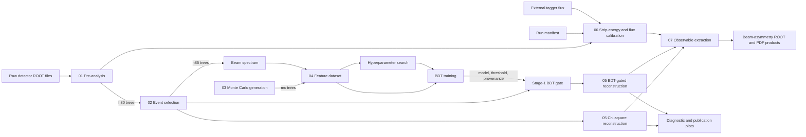

# GRAAL Analysis GitHub Wiki Design

## Goal

Create a detailed, maintainable GitHub Wiki that explains the current GRAAL
analysis project to both physicists running the analysis and developers
maintaining it. The wiki must make the scientific purpose, end-to-end data
flow, component responsibilities, persisted artifacts, operational commands,
failure behavior, and implementation boundaries understandable without
requiring readers to reconstruct the architecture from source code.

The documentation will describe the current working-tree architecture after
the repository reorganization. Historical components that no longer exist,
including the former `graal_pipeline` orchestrator, are outside the supported
workflow and must not be presented as current behavior.

## Audience and Language

The wiki targets two audiences:

- physicists and analysts who need to set up, execute, validate, and interpret
  the analysis;
- developers who need to understand package boundaries, algorithms, data
  contracts, tests, failure modes, and extension points.

All published wiki content will be written in English. Source identifiers,
physics notation, command names, and artifact names will match the repository.

## Documentation Principles

The wiki will use a layered-handbook structure. Readers can start with a short
operational overview, continue through the scientific and pipeline narrative,
and reach implementation-level reference material without duplicating the same
contracts across stage pages.

Documentation claims must be traceable to current source files, tests,
configuration, or versioned artifacts. Local ignored outputs and historical
comments are not authoritative. Where code, comments, tests, and old wiki text
disagree, executable behavior and tested contracts take precedence.

The wiki will document:

- implemented behavior;
- explicit assumptions and invariants;
- known limitations and missing capabilities.

It will not present speculative features or a future roadmap as implemented
behavior.

## Current System Model

The repository is a file-oriented scientific analysis pipeline. It has no
database, service process, or central pipeline orchestrator. Individual stage
entry points exchange ROOT, NPZ, JSON, CSV, text, model, image, and PDF
artifacts through the filesystem.

The current top-level responsibility map is:

| Area | Responsibility |
|---|---|
| `00_common/` | Shared physics registries, pairing, cross sections, Compton calculations, ROOT-array helpers, filesystem safety, and Stage-1 contracts |
| `01_pre_analysis/` | Detector-level ROOT pre-analysis and period-specific cut implementations |
| `02_event_selector/` | Event preselection from `h80` to `h85` trees |
| `03_mc_simulation/` | ROOT Monte Carlo generators and channel-status reporting |
| `04_bdt_training/` | Beam spectrum, feature dataset construction, weighting, hyperparameter search, training, reporting, and versioned Stage-1 artifacts |
| `05_reconstruction/` | ROOT-free reconstruction physics, runtime adapters, chi-square and BDT-gated paths, sidebands, two-pion reconstruction, and kinematic-fit validation |
| `06_calibration/` | Run-manifest construction and strip-energy/flux calibration |
| `07_observable_extraction/` | Beam-asymmetry estimators, background treatment, systematic covariance, calibrated input adapters, ROOT output, and diagnostic/publication plots |
| `plots/` | Reconstruction diagnostics and publication-oriented plots that consume completed outputs |
| `scripts/` | Repository setup and explicit wiki publication tooling |

## End-to-End Flow

The primary architecture diagram will represent this verified flow:

This diagram communicates artifact-level flow, not every import dependency.
Separate diagrams will describe internal and package-level relationships.

## Information Architecture

The wiki will be a set of Markdown pages under `wiki/`, with `Home.md` as the
entry page and `_Sidebar.md` as the complete navigation index.

### Orientation and architecture

- `Home.md`
- `getting-started.md`
- `architecture.md`
- `workflow.md`
- `repository-structure.md`
- `architecture-decisions.md`

### Scientific foundations

- `scientific-foundations.md`
- `physics-channels.md`
- `photon-pairing.md`
- `compton-beam-and-polarization.md`

### Pipeline stages

- `01-pre-analysis.md`
- `01-detector-cuts.md`
- `02-event-selection.md`
- `03-monte-carlo-simulation.md`
- `04-bdt-training.md`
- `04-dataset-and-features.md`
- `04-weighting-and-photon-loss.md`
- `04-training-artifacts.md`
- `05-reconstruction.md`
- `05-chi-square-pairing.md`
- `05-stage1-gate.md`
- `05-kinematic-fit.md`
- `05-sidebands-and-two-pion.md`
- `06-calibration.md`
- `07-observable-extraction.md`
- `07-beam-asymmetry-estimators.md`
- `07-background-correction.md`
- `07-systematics-and-outputs.md`

### Cross-cutting reference

- `plotting-and-diagnostics.md`
- `data-and-artifacts.md`
- `commands-and-configuration.md`
- `development.md`
- `testing.md`
- `troubleshooting.md`
- `known-limitations.md`

The final page set may consolidate two adjacent topics when source inspection
shows that separate pages would only repeat the same contract. Any
consolidation must preserve all approved subject areas and sidebar coverage.

## Standard Component Page Contract

Each stage or component page will use the following sections when applicable:

1. **Purpose and scope** — responsibility and explicit boundaries.
2. **Scientific role** — physical motivation and relation to the final
   measurement.
3. **Inputs and prerequisites** — files, ROOT trees and branches,
   configuration, models, and upstream stages.
4. **Processing flow** — ordered transformations, algorithms, and
   dependencies.
5. **Invariants and validation** — schemas, compatibility rules, numerical
   domains, and other conditions required for correctness.
6. **Outputs and persisted artifacts** — paths, formats, logical schemas,
   ownership, and downstream consumers.
7. **Command-line usage** — real commands, important options, defaults, and
   reproducible examples.
8. **Failure behavior** — fatal errors, warnings, atomic-output behavior, and
   recovery guidance.
9. **Implementation map** — responsible source files, classes, and functions.
10. **Tests and verification** — tests that establish the documented
    contracts and focused verification commands.
11. **Limitations and related pages** — current constraints and navigation to
    connected material.

Sections that do not apply will be omitted rather than filled with generic
text.

## Scientific and Algorithmic Detail

Equations will be included where they materially explain implementation:

- channel-yield and training-weight construction;
- photon-pairing chi-square;
- Compton edge and polarization transfer;
- kinematic-fit constraints and convergence outputs;
- normalized asymmetry ratios and conditional likelihood;
- background-fraction estimation and asymmetry correction;
- statistical and systematic covariance combination.

Each equation must map mathematical symbols to concrete input fields, model
objects, or output columns. The wiki will distinguish physical quantities from
training priors, diagnostic statistics, and implementation thresholds.

## Diagrams

GitHub-native Mermaid diagrams will cover:

1. end-to-end pipeline and artifact flow;
2. package dependency boundaries;
3. artifact lineage and ownership;
4. Stage-1 dataset-to-runtime model contract;
5. reconstruction decision flow;
6. calibration and observable-extraction flow;
7. validation, staging, and atomic-output failure flow.

Diagrams will remain focused rather than combining every relationship into one
graph. Each will include a prose caption, a textual or tabular equivalent for
accessibility and search, terminology identical to the repository, and links
to detailed pages. Only relationships verified in current code or tests may be
shown.

## Code and Source References

Wiki pages will reference repository-relative paths and stable symbol names.
Links may point to the corresponding files on the main GitHub repository.
Line-number links will be avoided because they become stale during normal
maintenance.

The primary evidence hierarchy is:

1. current executable source and command definitions;
2. tests that encode supported contracts and boundary behavior;
3. current configuration and versioned artifacts;
4. accurate source docstrings and comments;
5. historical wiki material, used only as a writing aid after verification.

## Failure Behavior to Document

The wiki must make operational safeguards visible, including:

- atomic output-directory replacement during event selection;
- refusal to reuse stale selected output when no valid input files exist;
- setup refusal to overwrite mismatched data paths or symlinks;
- Monte Carlo status distinction between missing channels and internal tool
  failure;
- Stage-1 artifact and hypothesis/provenance compatibility checks;
- required ROOT trees and branch validation;
- calibration input, fit, monotonicity, flux, QA, and output-location checks;
- warning-only findings versus fatal calibration failures;
- preservation of previous valid outputs when a run fails before publication;
- numerical-domain validation in observable extraction and systematic fits.

## Repository README

`README.md` will remain concise. It may receive a direct link to the GitHub
Wiki and minor consistency corrections needed to match the final page set. It
will not duplicate detailed stage or reference documentation.

## Wiki Publication Script

Restore `scripts/sync-wiki.sh` as the explicit publication mechanism. Its
supported behavior is:

1. create an isolated temporary checkout;
2. clone `GRAAL_Analysis.wiki.git`, or initialize an empty checkout when the
   wiki has no pages yet;
3. replace the remote checkout's Markdown pages with `wiki/*.md`, propagating
   deletions;
4. skip commit and push when there are no changes;
5. commit and push only when a maintainer invokes the script explicitly.

The implementation task will verify this script locally but will not run a
network clone or push. Publication remains a separate, explicit maintainer
action.

## Verification Strategy

Documentation verification will include:

- checking that every internal wiki link resolves to a retained page;
- checking that `_Sidebar.md` exposes every public page;
- scanning for removed architecture and stale paths, including
  `graal_pipeline`, `06_observable_extraction`, and `06_plots`;
- scanning for `TODO`, `TBD`, placeholders, and incomplete sections;
- comparing documented CLI options and defaults with current `argparse`
  definitions;
- comparing documented schemas and invariants with models and tests;
- validating `scripts/sync-wiki.sh` with `bash -n`;
- adding focused automated tests for the wiki structure and publication-script
  contract;
- running relevant focused tests and then the full pytest suite when the local
  ROOT environment permits it;
- running `git diff --check`;
- manually reviewing Markdown tables, Mermaid blocks, navigation, and page
  consistency.

If full tests cannot run because PyROOT or external scientific dependencies are
unavailable, the handoff must state the exact missing dependency and report all
focused checks that did run.

## Non-Goals

- Reintroducing a central pipeline orchestrator.
- Changing scientific algorithms, runtime behavior, data schemas, or CLI
  interfaces.
- Publishing the wiki remotely during implementation.
- Documenting unversioned local datasets as stable repository content.
- Promising future capabilities beyond a factual known-limitations section.
- Generating API documentation for every private helper when it does not help
  readers operate or maintain the system.

## Completion Criteria

The work is complete when:

- the approved page hierarchy exists under `wiki/`;
- both analyst and developer reading paths are clear from `Home.md`;
- every current top-level component and major subflow is documented;
- diagrams and textual equivalents describe verified relationships;
- commands, artifacts, schemas, invariants, failure modes, and tests are
  traceable to current repository sources;
- known limitations are explicit and separated from implemented behavior;
- the README points readers to the wiki without duplicating it;
- the synchronization script is restored and locally validated;
- link, structure, stale-reference, syntax, focused-test, and diff checks pass;
- no remote publication has occurred.
