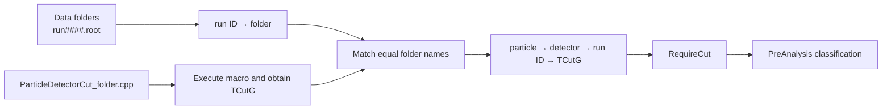

# 01 — Detector Cuts

Detector cuts are compiled ROOT `TCutG` polygons used by pre-analysis for
charged-particle identification. The cut system separates the stable dispatch
logic from period-specific polygon coordinates.

## Cut Manager

`01_pre_analysis/CutManager.h` owns two related indexes:

```text
run ID -> data-taking folder
particle -> detector -> run ID -> TCutG pointer
```

`BuildCutMap(dataPath, cutPath)` first scans immediate data subdirectories. A
file matching `run####.root` contributes its numeric run ID to the folder. It
then executes each recognized cut macro with ROOT, infers particle, detector,
and folder from the filename, and attaches the returned polygon to every run
mapped to that folder.



Text equivalent: run filenames establish membership in a data-taking folder;
cut filenames establish which polygon belongs to that folder; the shared
folder name joins them into a lookup keyed by the actual run ID.

The lookup API distinguishes three operations:

| Symbol | Contract |
|---|---|
| `HasCut` | Silent existence test with no diagnostic side effects |
| `GetCut` | Returns a pointer or `nullptr`, with diagnostics for missing keys |
| `RequireCut` | Enforces a required configuration; exits with code 1 when absent |
| `ValidateRunCuts` | Requires the complete applicable cut set once per run |
| `GetRunFolder` | Returns the mapped folder name, or an empty string for an unknown run |

That distinction is important. “Absent by design” and “missing by mistake”
must not both become a failed `IsInside` test: doing so would silently change
particle classification.

## Cut Families

The repository currently contains these families:

| Family | Coordinates passed to `IsInside` | Current files | Where used |
|---|---|---:|---|
| `ProtonCntCut` | `Eclusc_track`, `Dedx_track` | 22 | Central charged tracks, tested first |
| `PionCntCut` | `Eclusc_track`, `Dedx_track` | 22 | Central charged tracks not accepted as protons |
| `ProtonFwdCut` | `Tof_trf`, `De_trf` | 21 | Forward charged tracks outside excluded runs |
| `PionFwdCut` | `Tof_trf`, `De_trf` | 22 | Forward charged tracks outside excluded runs |
| `DeuteronFwdCut` | `Tof_trf`, `De_trf` | 8 | Forward charged tracks on deuterium targets only |

The `SetVarX` and `SetVarY` labels embedded in historical macro files are
descriptive metadata and are not the dispatch interface. `PreAnalysis::Loop`
passes the concrete values shown above to `TCutG::IsInside`.

Central proton precedence is observable behavior: a central charged candidate
inside the proton polygon is stored as a proton and is not subsequently tested
as a pion. Forward proton, pion, and deuteron tests are independent, so a
forward track is evaluated against every applicable family.

## Run-Period Variants

Cut filenames follow:

```text
<Particle><Detector>Cut_<folder>.cpp
```

Examples are `ProtonCntCut_1998_uv.cpp`, `PionFwdCut_2002_d3.cpp`, and
`DeuteronFwdCut_2006_d.cpp`. `ExtractFolderFromCutFile` treats everything
between `Cut_` and `.cpp` as the folder key.

The full central proton/pion and forward pion families cover these 22 folder
variants:

```text
1998_uv
1999_d1  1999_d2  1999_uv  1999_vis
2000_fuv 2000_uv1 2000_uv2 2000_vis
2001_d   2001_uv
2002_d1  2002_d2  2002_d3  2002_uv1 2002_uv2 2002_vis1 2002_vis2
2003_vis
2005_d1  2005_d2
2006_d
```

Two exceptions are intentional:

- `2005_d1` corresponds to `4577 < run < 4606`. `IsForwardExcluded` disables
  forward charged processing, so neither forward proton nor deuteron cuts are
  required there. A pion forward file exists but is not consulted in this
  interval.
- Deuteron files exist only for the eight deuterium variants that use the
  forward detector: `1999_d1`, `1999_d2`, `2001_d`, `2002_d1`, `2002_d2`,
  `2002_d3`, `2005_d2`, and `2006_d`.

`IsDeuteriumRun` derives target type from the final folder suffix: `_d`, `_d1`,
`_d2`, and similar suffixes begin with `d`; `_uv`, `_fuv`, and `_vis` do not.

## Extension Rules

To add a new data-taking folder safely:

1. Name raw files `run####.root` so run IDs enter `gRunToFolder`.
2. Add `ProtonCntCut_<folder>.cpp` and `PionCntCut_<folder>.cpp`.
3. Add forward proton and pion cut files unless the new run range has an
   explicit, reviewed detector exclusion.
4. Add `DeuteronFwdCut_<folder>.cpp` only for a deuterium target with usable
   forward detection.
5. Make every macro return a non-null `TCutG*`; use the filename stem as a
   unique object name and close the polygon.
6. Keep central polygons in the `(Eclusc_track, Dedx_track)` plane and forward
   polygons in `(Tof_trf, De_trf)` unless `PreAnalysis::Loop` is deliberately
   changed and validated with the cut.
7. Run `AnalyzeAll` on representative runs and inspect `PrintCutMap` before a
   production campaign.

Do not “fix” a missing required cut by changing `RequireCut` to `GetCut` or by
guarding `IsInside` with a null check. That converts configuration corruption
into plausible-looking output. New legitimate exceptions belong in explicit
target/run predicates and in `ValidateRunCuts`.

## Failure Modes and Verification

| Condition | Behavior |
|---|---|
| Data or cut directory cannot be opened | Diagnostic; dataset entry point treats missing directories as fatal |
| Macro execution reports an error | File is skipped while building the map; later `RequireCut` makes an applicable miss fatal |
| Macro returns no `TCutG` | Warning during map construction; applicable run later fails validation |
| Run does not belong to any scanned folder | `RequireCut` explains that the map was built from a different data directory, then exits |
| Required family missing for a known folder | Expected filename is printed, then execution exits |
| Deuteron cut absent on hydrogen data | Accepted by design because the cut is never requested |

Implementation is concentrated in `01_pre_analysis/CutManager.h`, with polygon
data in `01_pre_analysis/cuts/`. The consumer is `PreAnalysis::Loop` in
`01_pre_analysis/PreAnalysis.C`.

Related pages: [pre-analysis](01-pre-analysis),
[testing](testing), and [known limitations](known-limitations).
