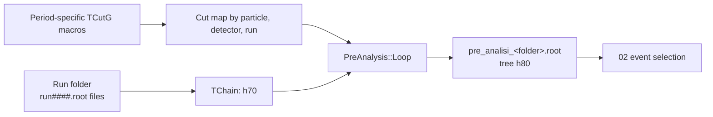
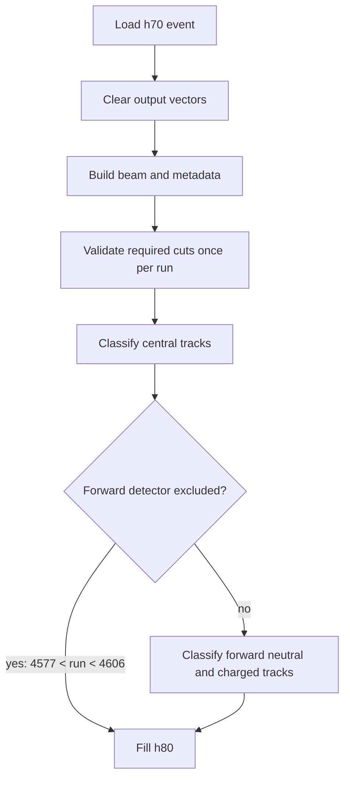

# 01 — Pre-Analysis

Pre-analysis is the detector-facing ROOT stage. It translates the raw GRAAL
`h70` acquisition tree into one normalized `h80` tree per data-taking folder.
It also applies run-dependent particle-identification cuts before later stages
see the event.

## Purpose

`01_pre_analysis/PreAnalysis.C` owns the boundary between the historical raw
tree schema and the analysis schema. Its responsibilities are deliberately
limited to:

- reading only the raw branches needed by this analysis;
- building the incident tagged-photon four-vector and reconstructed particle
  collections;
- classifying charged central and forward tracks through the cut map;
- preserving run, polarization, and tagger-strip metadata;
- writing every processed event to `h80`.

This stage does **not** require the final four-photon topology, perform photon
pairing, apply the Stage-1 classifier, or run a kinematic fit. Event topology
is narrowed by [event selection](02-event-selection); physics reconstruction
belongs to the Stage 05 pages.

## Input and Output Trees

### Input contract

`PreAnalysis` constructs a `TChain` named `h70`. The convenience entry point
accepts a ROOT file expression, normally a glob such as
`graal_data/1998_uv/*.root`, and enables only these raw branches:

| Group | Enabled branches | Use |
|---|---|---|
| Tagger | `Ncstrip`, `Eg_tag_strip`, `Xstrip` | Beam energy and tagger strip |
| Event metadata | `Idrun`, `Ipol` | Run and polarization state |
| Central tracks | `Nass_3`, `Thet_centr_track`, `Phi_centr_track`, `Itipo_track`, `Eclusc_track`, `Dedx_track` | Central photons and charged-particle identification |
| Forward tracks | `Nparf`, `Theta_trf`, `Phi_trf`, `Index_trf`, `Iass_trf`, `Tof_trf`, `De_trf` | Forward neutral/charged classification and kinematics |

The implementation uses element zero of `Eg_tag_strip` and `Xstrip`; raw input
is therefore expected to contain at least one valid tagger-strip entry for
each processed event. The selector does not add a fallback value when that
assumption is violated.

### Output contract

`PreAnalysis::Loop` creates a ROOT file in `RECREATE` mode and writes one tree
named `h80`. It reuses the same tree key on write to avoid extra ROOT `;N`
cycles.

| Branch | Logical type | Meaning |
|---|---|---|
| `beam` | Lorentz vector | Tagged photon, constructed as `(0, 0, E, E)` |
| `gammas` | vector of Lorentz vectors | Central neutral tracks identified as photons |
| `neutrons` | vector of Lorentz vectors | Forward neutral tracks in the neutron time-of-flight region |
| `protons` | vector of Lorentz vectors | Central or forward tracks inside proton cuts |
| `deuterons` | vector of Lorentz vectors | Forward tracks inside deuteron cuts for deuterium runs |
| `gamma_theta`, `gamma_phi` | `vector<double>` | Angles of forward neutral photon candidates |
| `pions_theta`, `pions_phi` | `vector<double>` | Angles of central and forward pion candidates |
| `deuterons_theta`, `deuterons_phi` | `vector<double>` | Angles of forward deuteron candidates |
| `fcharged_theta`, `fcharged_phi` | `vector<double>` | Forward charged-track angles |
| `fcharged_beta`, `fcharged_tof` | `vector<double>` | Forward charged-track beta and time of flight |
| `fcharded_de` | `vector<double>` | Forward charged-track deposited energy; spelling is part of the persisted schema |
| `Polarization` | integer | Copy of `Ipol` |
| `RunNumber` | integer | Copy of `Idrun` |
| `Xstrip` | float | First tagger-strip coordinate |

Unit handling follows the code exactly. Central track angles are converted to
radians when constructing four-vectors. `fcharged_theta` and
`fcharged_phi` store the converted radian values, while the auxiliary
`gamma_*`, `pions_*`, and `deuterons_*` angle arrays retain their source angle
values. Consumers must not assume every angle branch uses the same unit merely
because its name ends in `_theta` or `_phi`.

### Tree lineage



Text equivalent: `AnalyzeAll` groups raw ROOT files by run-period folder,
chains each folder's `h70` trees, resolves detector cuts by run number, and
writes `pre_analisi_<folder>.root` containing `h80`. Stage 02 consumes those
files.

## Processing Lifecycle

### Dataset-level orchestration

`AnalyzeAll(base_in, base_out, cuts_dir)` performs the dataset-level work:

1. Fail if the raw input directory or cut directory does not exist.
2. Create the output directory when needed.
3. Call `BuildCutMap` once, mapping run IDs found in raw filenames to cut
   objects loaded from `cuts_dir`.
4. Enumerate and sort immediate run subdirectories.
5. Invoke `PreAnalysis` with `<base_in>/<folder>/*.root`.
6. Write `<base_out>/pre_analisi_<folder>.root`.
7. Fail if the input directory contained no run subdirectories.

The output prefix is an interface: Stage 02 discovers `pre_*.root` files and
removes the first `pre_` from each published filename.

### Event-level lifecycle

For every entry, `PreAnalysis::Loop`:

1. loads the `h70` entry and clears every event-owned output vector;
2. constructs `beam`, `Polarization`, `RunNumber`, and `Xstrip`;
3. calls `ValidateRunCuts(Idrun)`; its internal run cache makes the expensive
   validation effective once per run;
4. scans central tracks, building central photons and classifying charged
   candidates as proton first, then pion;
5. scans forward tracks, separating neutral photon/neutron timing regions and
   recording charged-track observables;
6. skips the complete forward charged block for the excluded `2005_d1` run
   interval;
7. tests forward proton, pion, and—only on deuterium data—deuteron cuts;
8. fills `h80` without imposing a later-stage photon-multiplicity topology.



The diagram's exclusion condition corresponds to `2005_d1`. It suppresses the
whole forward charged block because that detector was unusable in that range;
it is not a physics selection on individual tracks.

## Failure Behavior and Recovery

- Missing raw or cut directories, an unreadable run listing, and an input
  directory without run subdirectories terminate `AnalyzeAll` with exit 1.
- A required cut missing for a known run terminates immediately through
  `RequireCut`; silently treating every candidate as outside the cut is not
  allowed.
- A deuteron cut on hydrogen data is absent by design and is never requested.
- A null `fChain` causes `Loop` to report the condition and return.
- This stage writes files directly with `RECREATE`; unlike Stage 02, it does not
  publish a whole output directory atomically. Remove or regenerate an
  incomplete per-folder file after an interrupted run.

## Implementation Map

| Path or symbol | Responsibility |
|---|---|
| `01_pre_analysis/PreAnalysis.h` | Raw `h70` schema, `TChain` construction, branch binding, and branch enablement |
| `PreAnalysis::Loop` | Per-event translation and particle classification |
| `PreAnalysis(input, output)` | Single input-expression wrapper |
| `AnalyzeAll` | Folder discovery, one-time cut-map construction, and per-folder output naming |
| `01_pre_analysis/CutManager.h` | Run-to-folder mapping, cut loading, lookup, validation, and explicit exceptions |
| `01_pre_analysis/cuts/*.cpp` | Versioned `TCutG` polygon definitions |

Primary verification lives in `tests/test_stage1_contracts.py` and the source
contracts exercised by downstream event-selection tests. Run the focused wiki
and selection checks with:

```bash
pytest tests/test_wiki.py tests/test_event_selector.py -q
```

See [detector cuts](01-detector-cuts) for the dispatch rules and
[data and artifacts](data-and-artifacts) for the complete artifact lineage.
