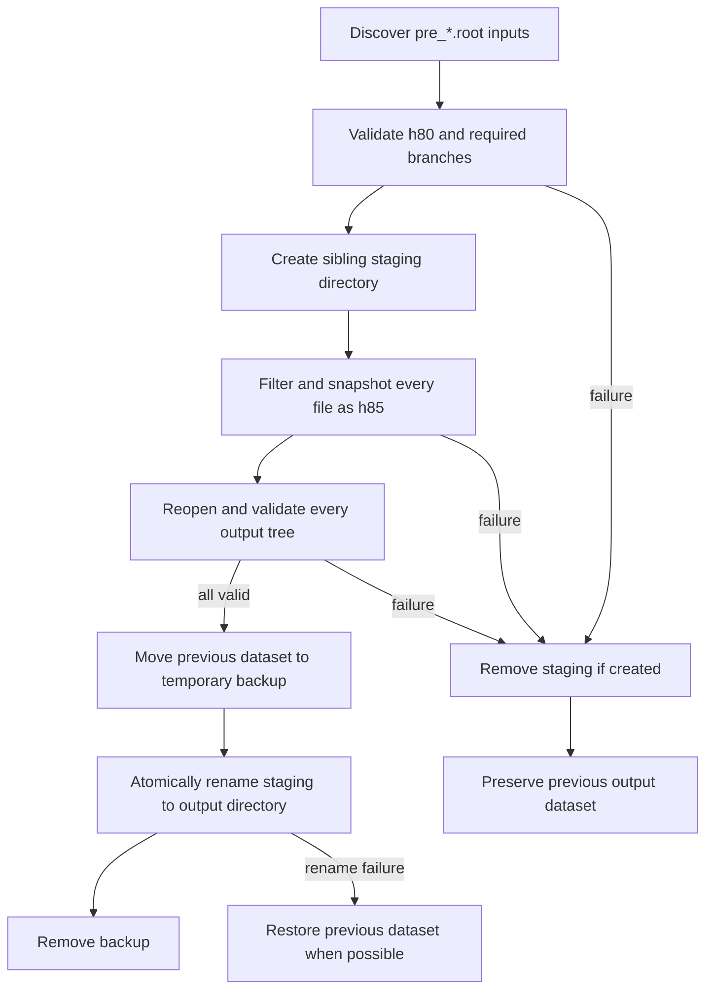

# 02 — Event Selection

Event selection is a narrow topology gate between detector pre-analysis and
reconstruction. It reads `h80`, retains events with enough photons and exactly
one forward charged track, and publishes a complete `h85` dataset atomically.

## Selection Contract

The entry point is `02_event_selector/select_events.py`. Its defaults follow
the numbered data layout:

```text
input:   data/02_pre_analyzed
output:  data/03_selected
threads: all available logical CPUs
```

Only regular files whose names match `pre_*.root` are processed. Files are
sorted for deterministic traversal. The first `pre_` prefix is removed from
each output name:

```text
pre_analisi_1998_uv.root -> analisi_1998_uv.root
```

For every input tree, ROOT `RDataFrame` applies exactly this filter:

```cpp
gammas.size() > 1 && fcharged_theta.size() == 1
```

This is intentionally weaker than the final four-photon reconstruction
topology: it requires at least two central photons and exactly one forward
charged track. All input branches are snapshotted into a tree named `h85`.
No branch projection or physics reconstruction occurs here.

Run with defaults:

```bash
python 02_event_selector/select_events.py
```

Run with explicit locations and worker count:

```bash
python 02_event_selector/select_events.py \
  --input-dir data/02_pre_analyzed \
  --output-dir data/03_selected \
  --threads 8
```

`--threads 1` disables parallel work. Before configuring the requested value,
the runner disables any already-enabled ROOT implicit multithreading state;
values below one are rejected.

## Required Branches

Before constructing the `RDataFrame`, `_select_file` opens the input ROOT file,
requires tree `h80`, and validates these branches:

| Branch | Why Stage 02 requires it |
|---|---|
| `gammas` | Photon-multiplicity term in the filter |
| `fcharged_theta` | Exactly-one-forward-charged-track term in the filter |
| `RunNumber` | Metadata required downstream |
| `Polarization` | Beam-polarization state required downstream |
| `Xstrip` | Tagger coordinate required by calibration/reconstruction consumers |

The complete input branch list is passed to `Snapshot`, so optional and
stage-specific `h80` branches are preserved. `RSnapshotOptions.fVector2RVec`
is explicitly set to `False`: serialized `std::vector` branches remain
`std::vector` rather than becoming `RVec`. This is required for the nested
Lorentz-vector type used by the real `gammas` branch.

After snapshotting, the implementation reopens the output, rejects zombie
files, requires tree `h85`, and reads its entry count. Publication cannot occur
until every staged file passes this validation.

## Atomic Output

The whole output directory—not each file independently—is the publication
unit. `atomic_output_directory` creates a hidden sibling staging directory,
and selection writes every output there.



Equivalent sequence:

1. discover and validate the inputs;
2. create a staging directory beside the destination;
3. write every selected `h85` file into staging;
4. reopen and validate every staged output;
5. temporarily move the previous output aside;
6. atomically rename the complete staging directory into place;
7. remove the backup only after publication succeeds;
8. on any earlier failure, delete staging and leave the previous dataset
   untouched; on a publication rename failure, restore the backup when the
   destination has not appeared.

This prevents reconstruction from observing a mixture of old and newly
selected files.

## Failure Behavior

| Failure | Result |
|---|---|
| `--threads < 1` | `ValueError`; no dataset is published |
| Input directory cannot be listed | Filesystem exception; previous output is untouched |
| No `pre_*.root` inputs | Fatal `RuntimeError`, including a sample of nonmatching entries; stale output is explicitly not reused |
| ROOT input cannot be opened or is a zombie | Fatal `RuntimeError` |
| `h80` missing | Fatal error listing available ROOT keys |
| Required branch missing | Fatal error listing missing branch names |
| Snapshot fails | Staging is removed; previous dataset remains |
| Output cannot be reopened or lacks `h85` | Staging is removed; previous dataset remains |
| Output path exists but is not a directory | `NotADirectoryError` |

No-input failure is a correctness boundary. Quiet success would allow Stage 05
to consume unrelated files left from a previous run.

## Implementation and Tests

| Path or symbol | Responsibility |
|---|---|
| `02_event_selector/select_events.py::parse_args` | CLI defaults and thread option |
| `_select_file` | ROOT schema validation, filter, snapshot, and output validation |
| `run` | multithreading state, discovery, no-input guard, and dataset-level publication |
| `00_common/io/filesystem.py::atomic_output_directory` | staging, swap, rollback, and cleanup |
| `tests/test_event_selector.py` | defaults, metadata preservation, vector compatibility, replacement, and rollback |

Focused verification:

```bash
pytest tests/test_event_selector.py -q
```

The ROOT-backed schema test is skipped explicitly when ROOT is unavailable;
publication tests remain executable through controlled file-level fixtures.

Related pages: [pre-analysis](01-pre-analysis),
[reconstruction](05-reconstruction), and
[data and artifacts](data-and-artifacts).
