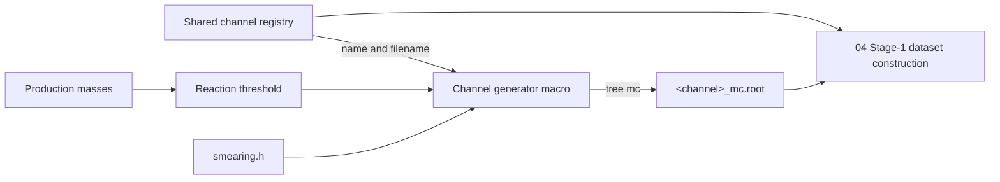
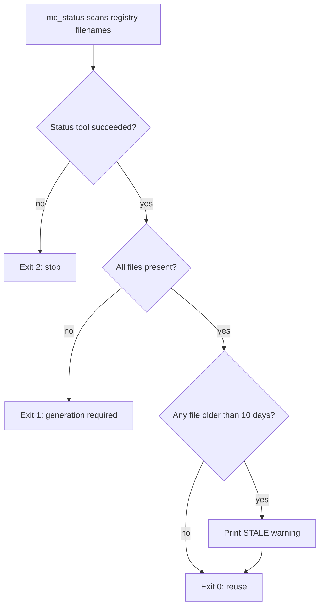

# 03 — Monte Carlo Simulation

Stage 03 generates signal and background reactions used by Stage-1 training
and reconstruction validation. ROOT macros own event generation and detector
smearing; the shared Python channel registry owns logical channel identity and
filenames; `mc_status` decides whether the on-disk set is complete.

## Generator Set

The repository currently has one macro per registered channel:

| Registry channel | Generator macro | Output | Generated photons |
|---|---|---|---:|
| `eta_pi0` | `generate_eta_pi0_dataset.C` | `eta_pi0_mc.root` | 4 |
| `pi0pi0` | `generate_pi0pi0_dataset.C` | `pi0pi0_mc.root` | 4 |
| `3pi0` | `generate_3pi0_dataset.C` | `3pi0_mc.root` | 6 |
| `eta_2pi0` | `generate_eta_2pi0_dataset.C` | `eta_2pi0_mc.root` | 6 |
| `omega_pi0` | `generate_omega_pi0_dataset.C` | `omega_pi0_mc.root` | 5 |
| `etaprime` | `generate_etaprime_dataset.C` | `etaprime_mc.root` | 6 |
| `eta_via_3pi0` | `generate_eta_via_3pi0_dataset.C` | `eta_via_3pi0_mc.root` | 6 |
| `4pi0` | `generate_4pi0_dataset.C` | `4pi0_mc.root` | 8 |
| `eta_pi0_via_3pi0` | `generate_eta_pi0_via_3pi0_dataset.C` | `eta_pi0_via_3pi0_mc.root` | 8 |

Macros live in `03_mc_simulation/generators/`. Each function defaults to one
million events and accepts a replacement event count. Generator output names
are relative to the current working directory, so run them from the data
directory expected by downstream consumers:

```bash
cd 03_mc_simulation/data
root -l -b -q '../generators/generate_eta_pi0_dataset.C(1000000)'
root -l -b -q '../generators/generate_pi0pi0_dataset.C(250000)'
cd ../..
```

ROOT resolves the local `smearing.h` include beside each generator macro; the
working-directory change controls only where the generated ROOT files land.

Each generator computes its reaction threshold from production masses and
draws beam energy uniformly from that threshold to `1.75 GeV`. This generated
beam distribution is not the measured GRAAL spectrum; Stage 04 later applies
beam-spectrum and channel weighting.

Generation uses `TGenPhaseSpace` with rejection unweighting through
`GenerateUnweighted`. The helper validates normalized phase-space weights,
tolerating only small ROOT floating-point excursions around `[0, 1]`.

## ROOT Output Contract

Every output contains a tree named `mc` and uses the registry-derived filename
`<channel>_mc.root`.

### Signal schema

`eta_pi0` exposes named physics objects and both true and smeared values:

- `beam`, `target`, `eta`, `pi0`, and `proton`;
- smeared `eta_gamma1`, `eta_gamma2`, `pi0_gamma1`, and `pi0_gamma2`;
- `eta_gamma1_true`, `eta_gamma2_true`, `pi0_gamma1_true`,
  `pi0_gamma2_true`, `proton_true`, and `beam_true`.

Its named smeared photon branches are also recorded in
`MCChannel.photon_branches`; Stage 04 therefore does not infer them by list
position.

### Generic background schema

The other eight channels write:

- `beam` and `proton`;
- smeared photons named consecutively `g0` through `gN`;
- integer `n_true_gamma`, which states the generator's photon multiplicity.

The file is authoritative for generic photon count. Registry consumers use
`n_true_gamma` instead of maintaining another hard-coded count table.

### Shared detector smearing

`03_mc_simulation/generators/smearing.h` centralizes:

| Helper | Behavior |
|---|---|
| `SmearTaggedPhoton` | Smears tagged energy with a 16 MeV FWHM converted to Gaussian sigma; returns `(0,0,E,E)` so the beam remains massless |
| `SmearPhoton` | Smears photon energy, polar angle, and azimuth; rebuilds a massless four-vector |
| `SmearProton` | Smears momentum and direction; recomputes energy with the proton mass |
| `GenerateUnweighted` | Repeats `TGenPhaseSpace::Generate` until the phase-space weight is accepted |



Text equivalent: registry identity determines filenames, generator masses
determine the lower beam-energy boundary, shared helpers implement smearing and
unweighting, and Stage 04 binds each ROOT file back to its registry channel by
filename.

## Channel Status

Run the status tool as a module:

```bash
python -m mc_simulation.mc_status
python -m mc_simulation.mc_status --data-dir /path/to/mc
```

The default directory is `03_mc_simulation/data`. For every name in
`CHANNEL_NAMES`, `status()` resolves `MCChannel.mc_filename` and records path,
existence, modification time, and age in days. The registry is the single
inventory: adding a registered channel automatically makes the status tool
require its file.

Files older than ten days are marked `STALE`. Age is operational information,
not evidence that physics content is invalid.

| Exit code | Meaning | Caller action |
|---:|---|---|
| 0 | Every registered file exists, even if one or more are stale | Reuse by default; regenerate only when explicitly requested |
| 1 | At least one registered file is missing | Generate the missing set according to the invoking workflow |
| 2 | Internal status failure | Stop; do not reinterpret the failure as missing MC |

Argument-parser help and invalid-argument exits remain normal `argparse`
`SystemExit` behavior. All other exceptions are reported on standard error and
mapped to exit 2.

## Regeneration Boundaries

Complete MC is expensive to produce, so presence and freshness are separate
decisions:



Equivalent decision table: an internal inspection error is fatal; a missing
file makes the set incomplete; an old but present file emits a warning and
still counts as complete. Staleness alone never authorizes automatic
regeneration. Use the calling workflow's explicit force option when changed
generator code or scientific assumptions require a new sample.

Regenerate when any input to the persisted MC contract changes, including:

- reaction or decay topology;
- production masses or energy range;
- phase-space weighting;
- smearing resolution or convention;
- output tree/branch schema;
- requested sample size or random-generation policy.

A change only to downstream Stage-1 weighting does not require new ROOT MC;
rebuild the derived feature dataset instead. Conversely, touching a file's
timestamp does not make old events scientifically current.

## Implementation and Verification

| Path | Responsibility |
|---|---|
| `03_mc_simulation/generators/` with `generate_*_dataset.C` files | Per-channel production and decay topology |
| `03_mc_simulation/generators/smearing.h` | Shared smearing and phase-space unweighting |
| `00_common/physics/channels.py` | Channel registry, filename property, masses, hypotheses, and weighting metadata |
| `03_mc_simulation/mc_status.py` | Completeness, age reporting, and exit semantics |
| `03_mc_simulation/tests/test_generator_physics.py` | Inventory, beam, FWHM, and unweighting invariants |
| `03_mc_simulation/tests/test_mc_status.py` | presence, age, warnings, and exit codes |

Focused verification:

```bash
pytest 03_mc_simulation/tests -q
```

ROOT-dependent generator checks are explicitly skipped when the `root`
executable is unavailable; pure-Python inventory and status checks still run.

Related pages: [physics channels](physics-channels),
[dataset and features](04-dataset-and-features), and
[weighting and photon loss](04-weighting-and-photon-loss).
