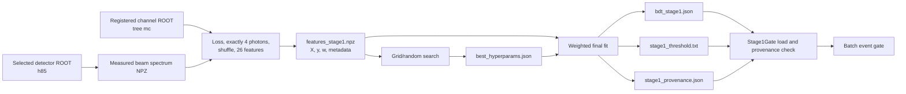

# 04 — Stage-1 BDT Training

Stage 04 builds a binary XGBoost classifier that rejects background-like
events before chi-square reconstruction. Training combines generated channels,
the measured detector beam spectrum, detector acceptance, physics-motivated
channel shares, a stable 26-column feature contract, and a versioned runtime
bundle.

## Training Pipeline

Stage 04 is a sequence of explicit commands, not a hidden orchestration
service:

1. measure the tagged-photon spectrum from selected detector data;
2. decode each registered Monte Carlo channel;
3. apply the same stochastic photon-loss/acceptance model to signal and
   backgrounds;
4. keep events with exactly four observed photons and randomize their order;
5. compute the shared Stage-1 feature vector;
6. integrate beam, cross-section, and acceptance information into event
   weights;
7. save an eight-key NPZ training dataset;
8. search XGBoost hyperparameters, optionally;
9. fit the final weighted classifier and select its weighted-F1 threshold;
10. publish model, threshold, provenance, metrics, and diagnostic plots.

The signal channel and the reconstruction hypothesis are separate choices.
`--signal-channel` chooses class 1; `--hypothesis` chooses the two meson mass
poles used by pairing-derived features. A channel may determine a default
hypothesis through the registry. If it does not, the builder refuses to guess.

## Entry Points

### 1. Measure the beam spectrum

```bash
python -m bdt_training.beam_spectrum \
  --selected-dir data/03_selected \
  --output 04_bdt_training/data/beam_spectrum.npz
```

Defaults are 150 bins over `0.5–2.0 GeV`. Empty ROOT files are skipped; no ROOT
files, all-empty files, or no events inside the histogram range are fatal.

### 2. Build the weighted feature dataset

```bash
python -m bdt_training.build_background_features \
  --mc-dir 03_mc_simulation/data \
  --signal-channel eta_pi0 \
  --beam-spectrum 04_bdt_training/data/beam_spectrum.npz \
  --signal-prior 0.5 \
  --loss-seed 42 \
  --output features_stage1.npz
```

Without `--background-channels`, every registered channel except the signal is
class 0. `--beam-spectrum` is required because channel yields are integrated
over measured beam flux. `--signal-prior` must be strictly between zero and
one. The loss seed fixes stochastic acceptance sampling and photon shuffling.

### 3. Search hyperparameters

```bash
python -m bdt_training.grid_search_stage1 \
  --features features_stage1.npz \
  --out-dir 04_bdt_training/artifacts/stage1 \
  --n-iter 30 \
  --seed 42
```

The default is a deterministic random sample of 30 configurations. Use
`--full-grid` to enumerate all 1,296 combinations in the current six-parameter
grid. Each candidate is capped at 400 trees with 20-round early stopping.

### 4. Train and publish

```bash
python -m bdt_training.train_bdt_stage1 \
  --features features_stage1.npz \
  --hyperparams 04_bdt_training/artifacts/stage1/best_hyperparams.json \
  --out-dir 04_bdt_training/artifacts/stage1 \
  --seed 42
```

CPU is the default XGBoost device and `--nthread -1` uses all available CPU
threads. `--no-verbose` disables the per-tree progress callback. Direct
`--n-estimators`, `--max-depth`, and `--lr` values are available when no search
file is supplied.

## Data Flow



Artifact equivalent:

| Producer | Artifact | Consumer | Contract |
|---|---|---|---|
| `beam_spectrum` | beam-spectrum NPZ | feature builder | normalized `edges` and `density` arrays |
| feature builder | `features_stage1.npz` | search and trainer | `X`, `y`, `w`, ordered names, channel, hypothesis, prior, beam flag |
| grid search | `grid_search_results.csv` | analyst | weighted validation AUC for successful candidates |
| grid search | `best_hyperparams.json` | final trainer | best row, including fitted tree count |
| final trainer | `bdt_stage1.json` | Stage-1 gate | XGBoost model |
| final trainer | `stage1_threshold.txt` | Stage-1 gate | scalar inclusive operating threshold |
| final trainer | `stage1_provenance.json` | Stage-1 gate and audit | physics identity and ordered feature schema |
| final trainer | metrics and PNG files | validation/review | weighted performance and diagnostic views |

The training/runtime invariant is stronger than “same number of columns.” The
gate imports the same `compute_stage1_features` implementation, reads the
hypothesis from provenance, and refuses a reconstruction hypothesis mismatch.

## Failure Boundaries

- Missing MC files, a signal duplicated among backgrounds, unresolved
  hypotheses, invalid priors, or channels with zero measured-beam overlap stop
  dataset construction.
- A background without either a reference cross-section or a signal branching
  relationship is rejected rather than assigned an invented weight.
- Malformed NPZ shapes, non-finite weights, unknown channel/hypothesis names,
  or missing identity metadata stop search/training.
- Search candidates that raise are reported and skipped. The CSV and best JSON
  contain only successful results; an empty successful set produces no best
  configuration.
- Matplotlib absence does not block model fitting; plots are omitted. The model,
  threshold, provenance, and text metrics are still written.

## Verification

| Test area | Main evidence |
|---|---|
| Feature order and train/runtime identity | `tests/test_stage1_contracts.py`, `04_bdt_training/tests/test_build_background_features.py` |
| Beam spectrum and thin-bin safeguards | `04_bdt_training/tests/test_beam_spectrum.py` |
| Photon loss | `04_bdt_training/tests/test_photon_loss.py` |
| Dataset persistence | `04_bdt_training/tests/test_stage1_dataset.py` |
| Physics shares | `04_bdt_training/tests/test_channel_weights.py` |
| Weighted fit and threshold | `04_bdt_training/tests/test_stage1_training.py`, `test_train_bdt_stage1.py` |
| Bundle schema | `00_common/tests/test_stage1_artifacts.py` |

Run the Stage-1 contract suite with:

```bash
pytest 00_common/tests/test_stage1_artifacts.py \
  04_bdt_training/tests tests/test_stage1_contracts.py -q
```

Detailed references: [dataset and features](04-dataset-and-features),
[weighting and photon loss](04-weighting-and-photon-loss),
[training artifacts](04-training-artifacts), and
[Stage-1 runtime gate](05-stage1-gate).
