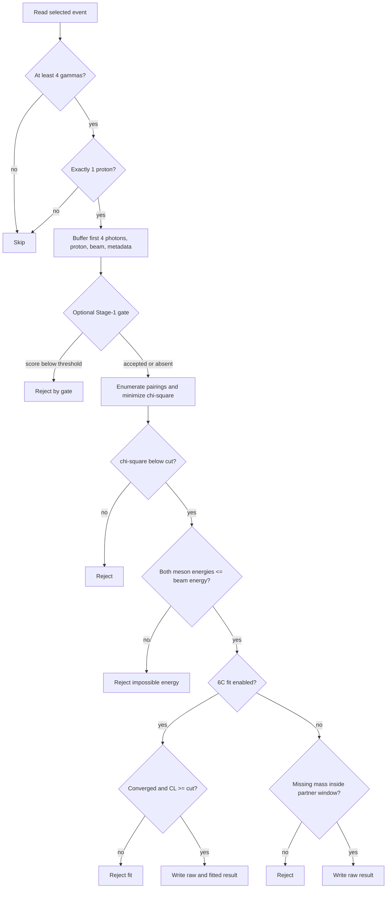

# 05 — Reconstruction

Stage 05 converts selected detector events into paired two-meson candidates.
ROOT adapters own file and tree operations; a NumPy core owns every physics
decision; an optional Stage-1 gate is the only intended difference between the
reference chi-square sample and the BDT-gated sample.

## Shared Reconstruction Core

`reconstruction.core.event_logic` is ROOT-free. Its immutable `EventInput`
contains four-vectors for photons, recoil proton, optional neutron, and beam,
plus run number, polarization, strip, and original photon multiplicity.
`reconstruct_event` returns either a `ReconstructedEvent` or one explicit
`RejectionReason`.

`RecoConfig` supplies the selection policy:

| Setting | Default | Effect |
|---|---:|---|
| `chi2_cut` | 10.0 | Reject best-pairing chi-square greater than or equal to this |
| `partner_mass` | proton mass | Center for no-fit missing-mass selection and output target vector |
| `missing_mass_window` | 0.06 GeV | Strict half-width; non-positive disables it |
| `do_fit` | true | Use the 6C fit instead of the missing-mass cut |
| `fit_cl` | 0.01 | Reject converged fits below this confidence level |
| `fit_cov` | `FitCovariance()` | Measurement-resolution model |
| `fit_reaction` | proton target/recoil | Mass assumptions inside fit constraints |

The shared pairing implementation is `00_common/physics/pairing.py`; training
features and reconstruction therefore use the same masses, partitions, and
chi-square expression.

`05_reconstruction/runtime/reco_core.py` owns ROOT chain construction, pre-pairing topology
guards, optional batch gating, conversion to/from arrays, output branches,
rejection counters, and final write. Input tree `auto` resolves a known
preselection tree—normally `h85`, with older `h80` supported.

## Supported Entry Points

| Module | Default output | Tree | Gate | Intended role |
|---|---|---|---:|---|
| `reconstruct_eta_pi0_chi2` | `results/reco/reco_eta_pi0_chi2.root` | `reco_eta_pi0_chi2` | no | eta-pi0 reference path |
| `reconstruct_eta_pi0_bdt` | `results/reco/reco_eta_pi0_bdt.root` | `reco_eta_pi0_bdt` | yes | primary Stage-1-gated eta-pi0 path |
| `reconstruct_eta_pi0_bdt_sideband` | `results/reco/reco_eta_pi0_bdt_sideband.root` | `reco_eta_pi0_bdt_sideband` | yes | broad raw-mass control sample |
| `reconstruct_2pi0` | `results/reco/reco_2pi0.root` | `reco_2pi0` | no | alternate two-pi0 analysis/control |

Example:

```bash
python -m reconstruction.reconstruct_eta_pi0_chi2 \
  --input-dir data/03_selected

python -m reconstruction.reconstruct_eta_pi0_bdt \
  --input-dir data/03_selected \
  --model-dir 04_bdt_training/artifacts/stage1
```

Common options select input/output, input tree, chi-square ceiling, recoil
partner, and missing-mass window. Eta-pi0 commands also expose `--no-fit` and
`--fit-cl`. The two-pi0 CLI does not expose those two fit switches.

## Event Flow



Equivalent sequence: topology guards run first; the optional gate evaluates
only guarded events; accepted events are paired; chi-square and impossible-
energy guards run; the enabled 6C fit replaces the missing-mass cut; only a
retained event is serialized. This order is tested, because moving the gate or
cuts would invalidate comparison between reference and gated samples.

Only the first four photons are paired. `n_photons_input` preserves the original
multiplicity. Exactly one proton is mandatory; no fictitious zero vector is
substituted. One neutron is preserved when present, otherwise the output
neutron is the zero four-vector.

## Output Trees

Every accepted row contains:

| Family | Branches |
|---|---|
| Decision and metadata | `chi2`, `<heavy>_mass`, `<light>_mass`, `RunNumber`, `Polarization`, `Xstrip`, `n_photons_input` |
| Optional gate | `bdt_score` only when a gate is active |
| Initial/recoil | `beam`, `target`, `proton`, `neutron`, `missing` |
| Raw mesons | `<heavy>`, `<heavy>_gamma1`, `<heavy>_gamma2`, `<light>`, `<light>_gamma1`, `<light>_gamma2` |
| Fit, when enabled | `eta_fit`, `pi0_fit`, `proton_fit`, four `*_fit_gamma*` branches, `fit_chi2`, `fit_ndf`, `fit_converged` |

For eta-pi0, heavy/light labels are `eta` and `pi0`; for the degenerate
two-pi0 hypothesis they are `pi0_1` and `pi0_2`. Fit branches retain historical
eta/pi0 names regardless of channel, a boundary to remember when inspecting
the alternate two-pi0 output.

Files are written directly in ROOT `RECREATE` mode, not through atomic
directory publication. Missing input directories/files, unreadable first
files, or unresolved trees fail loudly. Rejected events are counted by reason;
the function returns the number written.

Implementation map: `05_reconstruction/core/event_logic.py` owns decisions,
`05_reconstruction/core/reco_physics.py` owns supported final states and partner masses,
`05_reconstruction/core/kinematic_fit.py` owns fitting,
`05_reconstruction/runtime/reco_core.py` owns ROOT I/O, and
`05_reconstruction/runtime/cli_options.py` owns shared CLI translation.

See [chi-square pairing](05-chi-square-pairing), [Stage-1 gate](05-stage1-gate),
and [kinematic fit](05-kinematic-fit).
