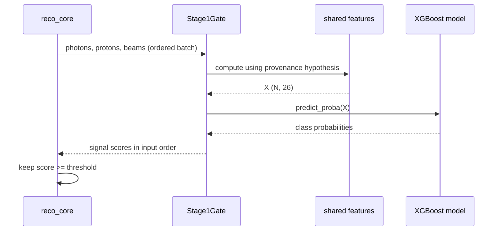

# 05 — Stage-1 Gate

The Stage-1 gate is a runtime-only adapter around the versioned XGBoost bundle.
It reuses the training feature function and rejects incompatible physics
hypotheses before reading the reconstruction dataset.

## Runtime Bundle

The default directory is
`04_bdt_training/artifacts/stage1/`, resolved relative to the repository by
`05_reconstruction/runtime/stage1_gate.py`. Load order is:

1. require `bdt_stage1.json`;
2. require `stage1_threshold.txt`;
3. require `stage1_provenance.json`;
4. import XGBoost and load the classifier;
5. parse the threshold as a float;
6. validate the closed provenance schema;
7. resolve its hypothesis through the shared registry.

Each missing file raises `FileNotFoundError` naming the exact path. Missing
provenance is never replaced by an eta-pi0 guess: without it the runtime cannot
know what the model was trained to identify. Metrics and plots are not needed
for scoring.

The gate imports no `bdt_training` modules. Its contracts come from
`graal_common.stage1.artifacts` and `graal_common.stage1.features`, keeping the
runtime boundary smaller than the training environment.

## Score and Threshold

`scores_many` computes the exact shared 26-column feature matrix for the
provenance hypothesis, then returns `predict_proba(X)[:, 1]` as a one-
dimensional `float64` array. This is the model's class-1/signal probability
before thresholding.

Acceptance is inclusive:

```text
accepted = score >= threshold
```

A score exactly equal to `stage1_threshold.txt` is retained. Gated ROOT output
stores the pre-threshold probability as `bdt_score`; ungated output does not
create that branch.

The runtime does not silently disable a missing or broken gate. Doing so would
turn a requested BDT sample into the reference sample while preserving a
misleading filename.

## Hypothesis Compatibility

`check_hypothesis(expected)` compares the provenance hypothesis name with the
reconstruction channel's hypothesis. A mismatch raises before
`run_reconstruction` begins and reports both the model's hypothesis and signal
channel.

Signal channel and hypothesis are related but not interchangeable: the former
states which MC reaction was class 1; the latter determines meson pole counts,
pairing chi-square, and candidate features. A model trained on `2pi0` can
produce numerical scores for eta-pi0 events, but those scores have the wrong
meaning and are refused.

The default eta-pi0 BDT entry point always calls:

```python
gate.check_hypothesis(ETA_PI0.hypothesis)
```

before constructing its reconstruction run.

## Batch Evaluation

`reco_core` accumulates up to 20,000 already-guarded events. One gate call
receives:

```text
photons: (N, 4, 4)
protons: (N, 4)
beams:   (N, 4)
```

All use `[px, py, pz, E]`. The returned score at position `i` belongs to input
event `i`; accepted events preserve order. Buffering changes when evaluation
happens, not which events reach it. Topology guards precede buffering, and
pairing/fit work runs only for accepted rows.

Batching amortizes NumPy and XGBoost call overhead; source measurements report
roughly a 300-fold gain over one-event calls at the chosen chunk size. The
buffer occupies only a few megabytes.



Text equivalent: reconstruction sends an ordered batch; the gate computes the
training-identical features for the recorded hypothesis; XGBoost returns one
signal score per row; reconstruction applies the stored inclusive threshold
and continues with pairing only for retained events.

Verification is concentrated in `05_reconstruction/tests/test_stage1_gate.py`,
`test_reco_core.py`, and `test_cli_options.py`.

See [training artifacts](04-training-artifacts) and
[reconstruction](05-reconstruction).
