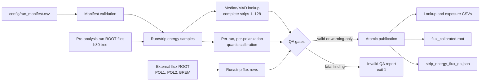

# 06 — Calibration

Stage 06 converts detector-level tagger strips and external flux histograms
into the run/strip exposure table consumed by observable extraction. Its
central invariant is that every selected event stratum `(run_number, xstrip)`
has one validated beam energy and three independent flux values: `POL1`,
`POL2`, and `BREM`.



Equivalent data flow:

1. Validate the authoritative run manifest.
2. Read `h80` from the pre-analysis ROOT files and summarize beam energy for
   each observed run/strip.
3. Fill missing strip energies where interpolation or extrapolation is
   defensible, and check the completed lookup for monotonicity.
4. Read the external `POL1`, `POL2`, and `BREM` histogram triplet for each run.
5. Join lookup, flux, and manifest metadata; integrate the flux in every
   configured energy binning.
6. Fit per-run/per-polarization strip calibrations and rewrite calibrated
   flux histograms on energy axes.
7. Publish the complete artifact set through an atomic directory swap.

## Run Manifest

`config/run_manifest.csv` is the authoritative mapping between a run and its
physics classification. Calibration does not infer or silently repair this
classification at runtime.

| Column | Meaning | Contract |
|---|---|---|
| `run_number` | GRAAL run identifier | unique positive integer; rows strictly increasing |
| `source_period` | acquisition-period directory | non-empty |
| `target` | target species | `P` or `D` |
| `beam_type` | laser/beam family | `UV` or `VIS` |
| `group` | aggregation key | exactly `P_UV`, `P_VIS`, `D_UV`, or `D_VIS`, consistent with target and beam |
| `classification_source` | origin of classification | an allowed non-`unresolved` value, normally `manual` or automatic provenance |
| `source_file` | pre-analysis input location | portable relative path whose basename is `run<run_number>.root` |

Absolute paths, Windows separators, parent traversal, duplicate runs,
unsorted rows, unresolved classifications, and group/target/beam conflicts are
fatal. Portable relative paths let another checkout reuse the manifest.

`06_calibration/build_run_manifest.py` can scan source periods. Automatic
classification covers the recognized proton UV/VIS periods. Deuterium and
otherwise ambiguous periods deliberately remain unresolved until a physicist
classifies them; validation then prevents an unresolved manifest from entering
production.

## Strip-Energy Calibration

The pre-analysis input is tree `h80`. The builder reads run number, `Xstrip`,
beam four-vector energy, and polarization metadata. `Xstrip` is converted to
an integer and must lie in `1..128`; beam energies must be finite and positive.

For every observed `(run_number, xstrip)` the lookup records:

| Field | Definition |
|---|---|
| `event_count` | number of all accepted events in the run/strip stratum |
| `energy_median_gev` | median of the retained beam-energy sample |
| `energy_mad_gev` | median absolute deviation of the retained sample around its median |
| `energy_min_gev`, `energy_max_gev` | range of the retained sample |
| `provenance` | `sampled`, `interpolated`, or `extrapolated` |

The scan counts every accepted event but retains at most
`--samples-per-run-strip` beam-energy values per stratum (default `256`) to
bound memory. Median, MAD, minimum, and maximum therefore describe that capped
sample; `event_count` describes the full accepted stratum.

### Missing strips

- With at least two observed strips in a run, interior gaps are linearly
  interpolated from their nearest bracketing strips.
- Missing strips outside the observed span are linearly extrapolated from the
  nearest two observed strips.
- Filled rows use `event_count = 0`, `energy_mad_gev = 0`, and identical
  minimum, median, and maximum energies. Provenance records how they were made.
- A run with exactly one observed strip keeps that observation but cannot be
  expanded to the full range.
- A requested run with no observations is fatal; fewer than two observations
  cannot support interpolation.

The completed lookup is checked for an overall monotonic direction. An
undetermined direction is fatal. A local inversion larger than
`--monotonic-tolerance-gev` (default `0.002` GeV) is also fatal.

### Calibrated ROOT histograms

The ROOT publication path independently builds calibration cells for every
run and polarization state. It fits strip-to-energy behavior with a quartic
polynomial (`pol4`). A fit requires at least five distinct strips and the full
calibration span; fit and derivative checks reject invalid or non-monotonic
maps. Flux histograms without a matching calibration are skipped and reported
as warnings. Publication fails if no flux histogram has a usable match.

## Flux Products

The external flux ROOT file must supply an unambiguous histogram triplet per
run: `POL1`, `POL2`, and `BREM`. `POL1` and `POL2` are the two polarized beam
states. `BREM` is an independent bremsstrahlung control exposure: it is not
subtracted from either polarized flux, and `BREM > POL1` or `BREM > POL2` is
not an error.

Negative histogram bins are clamped to zero and recorded. Non-finite content
is fatal. Any nonzero flux at a strip without an energy lookup is fatal; a zero
unmapped strip is harmless.

Built-in binnings are always produced:

| Name | Edges |
|---|---|
| `ajaka_cross_section` | 15 equal-width bins from 0.95 to 1.50 GeV |
| `ajaka_sigma` | 1.10, 1.20, 1.30, 1.40, 1.50 GeV |

Additional binnings use repeatable syntax
`--binning NAME:EDGE,EDGE,...`. Names must be non-empty and edges must be
finite and strictly increasing. The upper edge belongs to the final bin.

### Command

```bash
python 06_calibration/build_strip_energy_flux.py \
  --preanalysis-dir results/preanalysis \
  --manifest config/run_manifest.csv \
  --flux path/to/external_flux.root \
  --output-dir results/strip_energy_flux
```

Useful controls:

| Option | Default | Effect |
|---|---:|---|
| `--min-events-per-strip` | `1` | threshold for low-statistics warnings |
| `--max-mad-gev` | `0.005` | threshold for high-MAD warnings |
| `--monotonic-tolerance-gev` | `0.002` | largest tolerated local inversion |
| `--progress-every-events` | `1000000` | inner `h80` progress interval; `0` disables it |
| `--threads` | available CPU count | ROOT `RDataFrame` worker count |
| `--samples-per-run-strip` | `256` | retained energy samples per run/strip |
| `--binning` | none | append a custom named energy binning |

### Published artifacts

| Artifact | Granularity and purpose |
|---|---|
| `strip_energy_lookup.csv` | manifest metadata plus one robust energy summary per run/strip |
| `flux_by_run_energy.csv` | `POL1`, `POL2`, `BREM` integrated by run and named energy binning |
| `flux_by_run_strip.csv` | schema-v2 run/strip exposure contract used by Stage 07 |
| `flux_by_group_energy.csv` | integrated exposure aggregated by target/beam group |
| `flux_calibrated.root` | canonical flux histograms on fitted photon-energy axes and fit QA |
| `strip_energy_flux_qa.json` | inputs, thresholds, binnings, counts, diagnostics, warnings, errors, and `valid` |

`flux_by_run_strip.csv` has exact fields `schema_version`, `run_number`,
`source_period`, `target`, `beam_type`, `group`, `xstrip`,
`energy_median_gev`, `flux_pol1`, `flux_pol2`, `flux_brem`, and `status`.
Schema version is `2`. A row is `valid` only when both selected polarized
fluxes are positive; `BREM` need only be non-negative.

## QA and Failure Policy

Warnings preserve usable output but make limitations visible. Errors mark the
QA payload invalid and return exit status `1`.

| Warning-only condition | Consequence |
|---|---|
| Manifest run absent from `h80` | listed in QA; other runs continue |
| Extra complete `h80` or flux run | ignored and printed as unused |
| Negative flux bin | clamped to zero and listed |
| Low event count or high MAD | lookup retained with diagnostic |
| Non-positive selected `POL1`/`POL2` exposure | row marked invalid and excluded by Stage 07 |
| Calibrated ROOT histogram lacks matching calibration | histogram skipped and counted |
| Flux outside configured energy range | excluded amount and affected strips recorded |

| Fatal condition | Reason |
|---|---|
| Invalid manifest, schema, path, or option | input contract cannot be established |
| Missing/malformed/ambiguous flux triplet | polarization state cannot be identified safely |
| Non-finite flux | numerical result is undefined |
| Nonzero flux without strip-energy lookup | flux cannot be assigned an energy |
| Undetermined monotonic direction or excessive inversion | strip-to-energy map is not trustworthy |
| Invalid quartic fit/derivative or no calibrated histogram match | energy-axis ROOT product would be misleading |

Outputs are staged with `atomic_output_directory`; readers see either the old
complete directory or the new complete directory, never a partially written
set. The output directory may not contain any input path. On a caught fatal
error, the CLI attempts to atomically publish a failure-only QA JSON containing
the error. Exit status is `0` only when `qa.valid` is true; warnings alone do
not invalidate it.

## Source and Test Map

| Area | Source | Tests |
|---|---|---|
| manifest scan and validation | `06_calibration/build_run_manifest.py`, `06_calibration/run_manifest.py` | `06_calibration/tests/test_run_manifest.py` |
| lookup, interpolation, integration, schemas | `06_calibration/strip_energy_flux.py` | `06_calibration/tests/test_strip_energy_flux.py` |
| ROOT adapters, calibration fits, atomic CLI | `06_calibration/build_strip_energy_flux.py` | `06_calibration/tests/test_build_strip_energy_flux.py` |
