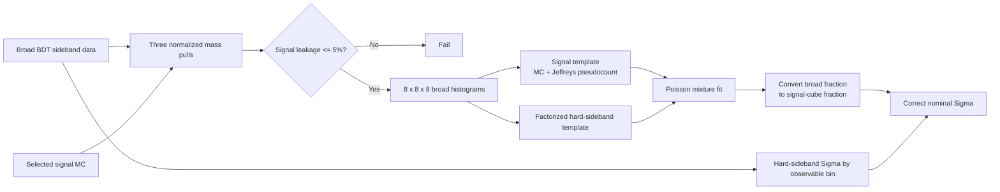

# 07 — Background Correction

The optional background workflow uses three raw mass coordinates jointly:
`eta` candidate mass, `pi0` candidate mass, and missing mass. It estimates the
background fraction in the central signal cube, measures the hard-sideband
asymmetry in the same observable bins, and corrects nominal Sigma points only
where both inputs exist.



## Mass Regions

Each coordinate is expressed as an absolute normalized pull. Before taking the
absolute value, the signed pulls are

```math
u_\eta=\frac{M_\eta-0.547862}{0.080},\qquad
u_{\pi^0}=\frac{M_{\pi^0}-0.134977}{0.040},\qquad
u_{miss}=\frac{M_{miss}-0.938272}{0.060}.
```

Masses and half-widths are in GeV. The eta and pi0 constants come from the
shared `ETA_PI0_HYP` physics definition; the missing-mass half-width is owned
by the observable extraction workflow.

An event is classified by all three absolute pulls:

| Region | Definition |
|---|---|
| signal | all three pulls `< 1` |
| hard sideband | all three pulls `< 4`, and at least two pulls are in `[2,4)` |
| transition | all three pulls `< 4`, but not signal or hard sideband |
| outside | any pull `>= 4` |

The strict inequalities make boundary ownership deterministic. Non-finite mass
inputs fail classification.

Background fractions are estimated independently in the four fixed photon
energy bins. The broad data and signal MC are histogrammed over `[-4,4]` on
each pull axis with eight unit-width bins, producing an `8 x 8 x 8` cube. An
energy bin is skipped if broad data, signal MC, or hard-sideband data are
absent or have zero histogram integral.

## Sideband Template

The hard-sideband definition intentionally leaves the central signal cube
empty. Direct bin-by-bin extrapolation would therefore predict no background
under the peak. The implementation instead constructs a factorized template:

```math
B(i,j,k)=b_\eta(i)b_{\pi^0}(j)b_{miss}(k),
```

where each one-dimensional marginal is obtained by summing the hard-sideband
histogram over the other two axes. A Jeffreys pseudocount of `0.5` is added to
every marginal bin before normalization. The outer product is normalized to
unit integral, allowing an explicit, reproducible interpolation into the
signal cube.

The signal template is the selected signal-MC three-dimensional histogram
with `0.5` added to every cell, then normalized. Both template paths therefore
avoid zero-probability cells while keeping the smoothing assumption visible.

This factorization assumes the three background mass pulls are independent at
template level. It is a modeling approximation, not a measured identity; the
`background_template` systematic records the resulting correction shift, but
the current production path does not fit a correlated background model.

### Signal-leakage gate

The selected signal-MC sample is classified with the same regions. Its hard
sideband leakage is

```math
L=\frac{N_{MC}^{hard}}{N_{MC}^{all}}.
```

The workflow requires `L <= 0.05`. An empty signal-MC region sample or leakage
above 5% is fatal, because the data-derived hard sideband would otherwise be
too contaminated to represent background safely.

## Background Fraction

For each energy bin, the broad data histogram `n_q` is fit as a two-template
Poisson mixture. With normalized signal template `S_q`, normalized background
template `B_q`, total broad count `N`, and broad-region fraction `f`,

```math
\mu_q(f)=N\left[(1-f)S_q+fB_q\right],\qquad 0\le f\le1.
```

The minimized objective omits constants independent of `f`:

```math
NLL(f)=\sum_q\left[\mu_q(f)-n_q\log\mu_q(f)\right].
```

Curvature at the optimum gives the broad-fraction uncertainty. A bin with
positive data in a zero-expectation cell has infinite NLL.

The fitted broad fraction is not yet the contamination of the central signal
selection. Let `A_S` and `A_B` be the signal and background template integrals
inside the signal-cube mask. The published correction fraction is

```math
f_{sig}=\frac{fA_B}{(1-f)A_S+fA_B}.
```

Its uncertainty is propagated by evaluating this conversion at the fitted
`f` plus and minus its curvature error, clipped to `[0,1]`, and taking half
the resulting span. The stored fraction is capped just below one so the later
correction denominator remains defined.

## Corrected Asymmetry

The hard-sideband events are passed through the same pair projections, fixed
energy/mass grid, exposure map, and requested estimator as the nominal sample.
This yields `Sigma_bg` per estimator, pair, energy bin, and mass bin.

For a matching nominal point, energy-bin fraction, and background point:

```math
\Sigma_{corr}=\frac{\Sigma_{obs}-f_{sig}\Sigma_{bg}}{1-f_{sig}}.
```

Assuming the observed fit, background fit, and fraction estimates are
independent, the propagated variance is

```math
\delta^2\Sigma_{corr}=
\left(\frac{\delta\Sigma_{obs}}{1-f}\right)^2+
\left(\frac{f\,\delta\Sigma_{bg}}{1-f}\right)^2+
\left(\frac{(\Sigma_{obs}-\Sigma_{bg})\delta f}{(1-f)^2}\right)^2.
```

Asymmetric input errors are reduced to the mean half-width before this
propagation. The corrected point stores the propagated value symmetrically in
`stat_low` and `stat_high`; `sigma_uncorrected` preserves the original value,
and `background_fraction` stores `f_sig`.

If either fraction or background asymmetry is missing for a bin, the point is
left uncorrected rather than guessed. The ROOT diagnostic
`diagnostics/uncorrected_vs_corrected` makes the applied shifts inspectable.

## Preconditions, Warnings, and Failures

- `--sideband` and `--signal-mc` must be supplied together.
- Broad data use tree `reco_eta_pi0_bdt_sideband` and raw four-vectors.
- Signal MC must expose the same tree/branch contract expected by the adapter.
- Templates must have matching shapes, finite non-negative contents, and
  positive integrals.
- The fraction must be in `[0,1]`; correction requires `f < 1`.
- Negative uncertainties and invalid sideband window widths are rejected.
- Sparse energy bins are omitted from correction, not filled by neighboring
  fractions.

## Source and Test Map

| Responsibility | Source | Tests |
|---|---|---|
| regions, templates, mixture, correction | `core/background.py` | `test_background.py` |
| pull definitions and energy-bin orchestration | `beam_asymmetry.py` | `test_beam_asymmetry_cli.py` |
| broad sideband producer | `05_reconstruction/reconstruct_eta_pi0_bdt_sideband.py` | Stage 05 sideband tests |
| selected signal-MC adapter | `05_reconstruction/prepare_signal_mc_selected.py` | `05_reconstruction/tests/test_prepare_signal_mc_selected.py` |
