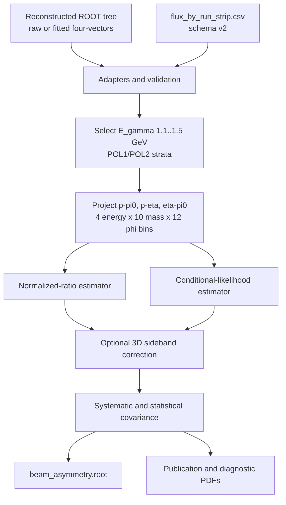

# 07 — Observable Extraction

Stage 07 is the publication boundary for the beam asymmetry of
`gamma p -> eta pi0 p`. It joins reconstructed events to schema-v2 calibrated
exposures, projects all three two-body subsystems, estimates `Sigma`, applies
optional background corrections, builds covariance matrices, and writes ROOT
and PDF products. It does not modify Stage 05 reconstruction files.



Equivalent ordered workflow:

1. Load calibrated run/strip exposures for proton UV data.
2. Read the selected reconstructed ROOT sample into detached NumPy arrays.
3. Keep polarization states `1` and `2` in 1.1–1.5 GeV and join every event
   to its `(run_number, xstrip)` exposure.
4. Project `p-pi0`, `p-eta`, and `eta-pi0` masses and azimuths.
5. Run the requested ratio, likelihood, or both estimators in the fixed grid.
6. If both control inputs are supplied, estimate the sideband fraction and
   background asymmetry, then correct matching points.
7. Load available comparison reconstruction samples without replacing the
   nominal result.
8. Build statistical, bootstrap, and named systematic covariance matrices.
9. Atomically write the ROOT result and generate the PDF suite.

## Inputs and Preconditions

### Calibrated exposures

`flux_by_run_strip.csv` in `results/strip_energy_flux/` is loaded with an exact
schema check and schema version `2`. Defaults select target `P`, beam type
`UV`, and energy range 1.1–1.5 GeV. Mappings are:

- `POL1` -> vertical exposure;
- `POL2` -> horizontal exposure;
- `BREM` -> independent unpolarized control exposure;
- UV polarization -> Compton transfer calculated from strip energy.

The loader requires positive selected `POL1` and `POL2` flux, non-negative
`BREM`, unique `(run_number, xstrip)` keys, finite values, and polarization in
`[0,1]`. The orchestration layer uses `skip_invalid=True`, prints how many
invalid exposure rows it skipped, and fails if no selected exposure remains.

### Reconstructed events

The event adapter requires branches `RunNumber`, `Xstrip`, `Polarization`,
`beam`, `eta`, `pi0`, `proton`, `missing`, `eta_mass`, `pi0_mass`, and
`n_photons_input`. Fit-vector mode additionally requires `eta_fit`, `pi0_fit`,
and `proton_fit`. `bdt_score` is optional; absent values become `NaN`.

Raw mode uses the original `eta`, `pi0`, and `proton` four-vectors. Fit mode
uses the three fitted vectors but deliberately retains raw missing mass for
the sideband coordinate. ROOT objects are copied into NumPy arrays before the
input file is closed.

Polarization states `1` and `2` form the Sigma sample; state `0` forms the
`BREM` false-asymmetry control. Events outside 1.1–1.5 GeV are excluded.
Missing exposure is normally an error in the adapter. The main CLI sets
`drop_missing=True`, emits a warning with event and stratum counts, and drops
those events so the omission is explicit.

### Fixed analysis grid

| Axis | Binning |
|---|---|
| photon energy | `[1.10, 1.20, 1.30, 1.40, 1.50]` GeV |
| azimuth | 12 uniform bins on `[0, 2 pi]` |
| subsystem | `p_pi0`, `p_eta`, `eta_pi0` |
| invariant mass | 10 bins from pair threshold to `Wmax(1.5 GeV) - spectator mass` |

Intervals are lower-inclusive and upper-exclusive, except the final bin also
includes its upper edge. The CLI currently enforces exactly 12 azimuth bins
and 10 mass bins; its options expose the contract but do not permit an
alternative nominal grid.

## Extraction Workflow

`07_observable_extraction/beam_asymmetry.py` owns orchestration. Its default
sample contracts are:

| Sample | Default file | Tree | Vectors | Role |
|---|---|---|---|---|
| `raw` | `results/reco/reco_eta_pi0_chi2_raw.root` | `reco_eta_pi0_chi2` | raw | reconstruction comparison |
| `raw_bdt` | `results/reco/reco_eta_pi0_bdt_raw.root` | `reco_eta_pi0_bdt` | raw | default nominal sample |
| `raw_bdt_fit` | `results/reco/reco_eta_pi0_bdt_fit.root` | `reco_eta_pi0_bdt` | fitted | fit-vector comparison |

The default estimator mode is `both`. Ratio points retain their per-phi
`TGraphErrors` and cosine fit; likelihood points retain profile-interval
errors. Detailed equations and domains are in
[Beam-Asymmetry Estimators](07-beam-asymmetry-estimators).

The nominal sample is always required. Other sample files are comparison
inputs: if absent, the workflow warns and continues. If present, they are
processed with the same exposure map, grid, and selected estimator mode.

Sideband correction is enabled only when `--sideband` and `--signal-mc` are
supplied together. Supplying only one is fatal. See
[Background Correction](07-background-correction) for the three-dimensional
template model and correction equation.

If no point in any pair/energy/mass bin can be fitted, the workflow fails with
`no beam-asymmetry bins could be fitted`. Individual sparse ratio bins are
skipped when their fit preconditions are not met; likelihood bins require at
least four events and both polarized states.

### Command

```bash
python 07_observable_extraction/beam_asymmetry.py \
  --raw-bdt results/reco/reco_eta_pi0_bdt_raw.root \
  --calibration-dir results/strip_energy_flux \
  --output-dir results/beam_asymmetry
```

Important defaults:

| Option | Default |
|---|---|
| `--nominal-sample` | `raw_bdt` |
| `--estimator` | `both` |
| `--phi-bins` | `12` |
| `--mass-bins` | `10` |
| `--bootstrap-replicas` | `0` (disabled) |
| `--bootstrap-seed` | `1208` |
| `--calibration-dir` | `results/strip_energy_flux` |
| `--output-dir` | `results/beam_asymmetry` |

## Public Products

The public interface is intentionally ROOT plus figures; the observable CLI
does not emit CSV or JSON summaries.

| Product | Contents |
|---|---|
| `beam_asymmetry.root` | `sigma_points` tree, ID mapping, bin edges, covariance matrices, ratio objects, diagnostic graphs, provenance |
| `figure4_experimental.pdf` | 4-by-3 energy/subsystem panel of nominal Sigma points |
| `comparison_reconstruction_samples.pdf` | raw, raw-BDT, and fitted-vector comparison when available |
| `comparison_estimators.pdf` | ratio versus conditional-likelihood comparison |
| `fit_diagnostics.pdf` | fit quality and fallback diagnostics |
| `systematic_summary.pdf` | named systematic covariance summary |
| `background_control.pdf` | optional background fraction and signal-leakage control |
| `false_asymmetry_controls.pdf` | `BREM` control azimuths |
| `photon_multiplicity.pdf` | inclusive versus exactly-four-input-photon study |

ROOT schema and covariance composition are detailed in
[Systematics and Outputs](07-systematics-and-outputs).

## First-Pass and Full Modes

“First pass” and “full mode” are operational configurations of the same CLI,
not separate subcommands.

### First pass

Use the default nominal `raw_bdt` sample, `--estimator both`, no sideband
arguments, and the default `--bootstrap-replicas 0`. This validates exposure
joins, bin population, sign conventions, estimator agreement, harmonic fit
quality, false-asymmetry controls, and the public ROOT/PDF layout. Results are
explicitly uncorrected for background.

### Full analysis

Supply the broad sideband ROOT file and selected signal-MC file together,
provide any available comparison samples, and request a reviewed positive
bootstrap replica count. The same nominal extraction is then augmented by:

- three-dimensional background fractions and hard-sideband asymmetries;
- corrected Sigma values with propagated uncertainties;
- raw versus fitted-vector and ratio versus likelihood shifts;
- photon-multiplicity and angular-leakage shifts when available;
- run-block bootstrap covariance;
- background control and the full diagnostic figure set.

The code does not assign a production bootstrap count: `0` is a deliberate
safe default. Analysis owners must choose and record a sufficiently large
replica count for the intended statistical precision.

## Failure and Warning Summary

Fatal conditions include an unreadable ROOT file/tree, missing required
branches, an invalid exposure schema, no usable exposures, mismatched
sideband arguments, invalid fixed bin counts, or no fitted points. Warnings
cover skipped invalid exposures, events without exposures, absent optional
comparison samples, an unavailable photon-multiplicity study, and a requested
bootstrap with fewer than two runs.

## Source and Test Map

| Responsibility | Source | Principal tests |
|---|---|---|
| CLI orchestration | `07_observable_extraction/beam_asymmetry.py` | `test_beam_asymmetry_cli.py` |
| exposure adapter | `07_observable_extraction/calibration/flux_v2.py` | `test_calibration_io.py` |
| ROOT event adapter | `07_observable_extraction/io/reconstructed_events.py` | `test_reconstructed_events.py` |
| grid and projections | `07_observable_extraction/core/binning.py`, `07_observable_extraction/core/kinematics.py` | `test_binning.py`, `test_kinematics.py` |
| ROOT publication | `07_observable_extraction/io/root_output.py` | `test_root_output.py` |
