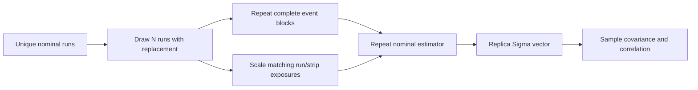

# 07 — Systematics and Outputs

Stage 07 represents uncertainty as covariance over the ordered list of
published `OutputPoint` objects. Statistical fit errors, optional run
bootstrap, and named systematic shifts remain separate in memory and in ROOT,
then are combined into a total matrix. This preserves correlations that a
single per-point error bar would discard.

## Systematic Components

A systematic variation is represented by a signed shift vector `Delta` with
one value per output point. Its magnitude and fully correlated covariance are

```math
m_i=|\Delta_i|,\qquad C^{(k)}_{ij}=\Delta_i\Delta_j.
```

The sign therefore matters for inter-bin correlations even though the plotted
per-point systematic size uses `|Delta|`.

### Components materialized by the current CLI

| Component | Shift definition | Availability |
|---|---|---|
| `polarization_scale_3pct` | `-0.03 Sigma` because Sigma is inversely proportional to polarization scale | always present when points exist |
| `estimator_ratio_vs_likelihood` | half the counterpart-estimator difference | only where both estimators exist; omitted if all shifts are zero |
| `raw_vs_kinematic_fit` | half the `raw_bdt`/`raw_bdt_fit` difference | only where both samples exist; omitted if all shifts are zero |
| `background_template` | corrected minus uncorrected Sigma | only where correction changes a point |
| `angular_offset_sine_leakage` | diagnostic `s2` coefficient | only for fallback fits with nonzero `s2` |
| `photon_multiplicity` | exactly-four-input-photon result minus inclusive result | included when both selections reproduce every nominal bin |

The photon-multiplicity study uses `n_photons_input == 4`; it does not claim
that best-quartet resolution has been implemented. If the restricted sample
is empty or loses a fitted bin, the CLI warns, omits this component, and still
writes `photon_multiplicity.pdf` with the available counts.

`07_observable_extraction/core/systematics.py` also declares a broader
`REQUIRED_SYSTEMATICS` analysis
catalog (`flux_balance`, `bdt_threshold`, `sideband_definition`,
`fit_fallback`, `mass_phi_binning`, `run_period_stability`, and others). That
catalog is a requirements checklist, not proof that every named covariance is
currently produced by `beam_asymmetry.py`. A ROOT file contains only the
components actually computed in that run.

### False-asymmetry controls

`randomize_polarization_labels` provides a deterministic seeded permutation of
states `1` and `2`, preserving their counts and rejecting BREM state `0`. It is
tested as a building block but is not currently invoked by the public CLI.
The produced false-asymmetry PDF instead shows azimuth distributions from the
independent `BREM` control sample. This distinction prevents a planned
randomized-label study from being mistaken for an existing product.

## Bootstrap by Run

Run bootstrap is disabled by default (`--bootstrap-replicas 0`). For a
positive replica count, unique run identities are sampled with replacement;
every selected run contributes its entire event block. If a run is drawn more
than once, its events are repeated and all of its run/strip exposures are
scaled by the same multiplicity. Event and normalization resampling therefore
remain coupled.



Each replica must return a finite one-dimensional vector with exactly the
nominal fitted-bin keys. A replica that loses a bin is fatal because silently
changing vector dimension would corrupt covariance alignment. The seed
defaults to `1208`, making a fixed command reproducible.

Bootstrap is skipped with a warning when the nominal sample contains fewer
than two unique runs. One replica is permitted by the core helper and yields a
zero covariance, but meaningful covariance estimation requires multiple
replicas; production analyses should choose and record a reviewed larger
count.

## Covariance Combination

The initial statistical covariance is diagonal:

```math
C^{fit}_{ii}=\left(\frac{\delta^-_i+\delta^+_i}{2}\right)^2.
```

When bootstrap covariance `C_boot` exists, its off-diagonal terms are copied
into the statistical matrix. Each diagonal becomes the larger of the original
fit variance and bootstrap variance:

```math
C^{stat}_{ij}=C^{boot}_{ij}\quad(i\ne j),\qquad
C^{stat}_{ii}=\max(C^{fit}_{ii}, C^{boot}_{ii}).
```

The total covariance is

```math
C^{total}=C^{stat}+\sum_k C^{(k)}_{syst}.
```

Per-point `syst_total` is the square root of the summed systematic diagonals;
it excludes statistical variance. Covariance matrices must be square and all
components must match the output-point dimension. Correlation matrices divide
by the outer product of diagonal standard deviations and use zero where that
denominator vanishes.

## ROOT and Figure Outputs

`beam_asymmetry.root` is written to a temporary sibling file and renamed only
after successful closure, preventing a half-written public ROOT artifact.

### ROOT object layout

```text
beam_asymmetry.root
├── sigma_points                         TTree
├── id_mapping                           TNamed
├── provenance                           TNamed
├── binning/
│   ├── energy_edges                     TVectorD
│   ├── p_pi0_mass_edges                 TVectorD
│   ├── p_eta_mass_edges                 TVectorD
│   └── eta_pi0_mass_edges               TVectorD
├── covariance/
│   ├── total                            TH2D
│   ├── correlation_total                TH2D
│   ├── statistical                      TH2D
│   ├── bootstrap_run                    TH2D, optional
│   ├── correlation_bootstrap_run        TH2D, optional
│   └── systematic/<component>           TH2D per materialized component
├── diagnostics/
│   ├── ratio_vs_likelihood              TGraphErrors
│   └── uncorrected_vs_corrected          TGraph
├── ratio_objects/<pair>/eN/mN/
│   ├── ratio                            TGraphErrors
│   └── fit                              TF1, [0] cos(2x)
└── ratio_overlays/<pair>/eN/mN/
    └── overlay                          TCanvas, ratio and fit overlaid
```

`sigma_points` uses integer IDs for sample, estimator, and pair; `id_mapping`
stores their text mapping. Pair IDs are fixed: `p_pi0=0`, `p_eta=1`, and
`eta_pi0=2`. Sample and estimator IDs are assigned from sorted names present in
the file.

| Branch family | Branches |
|---|---|
| identity | `sample_id`, `estimator_id`, `pair_id`, `energy_bin`, `mass_bin` |
| bin coordinates | `energy_low_gev`, `energy_high_gev`, `mass_low_gev`, `mass_high_gev`, `mass_center_gev`, `mass_mean_gev` |
| result | `sigma_uncorrected`, `sigma`, `stat_low`, `stat_high`, `syst_total`, `background_fraction` |
| normalization | `count_vertical`, `count_horizontal`, `flux_vertical`, `flux_horizontal`, `polarization_vertical`, `polarization_horizontal` |
| fit diagnostics | `fit_chi2`, `fit_ndf`, `fit_p_value`, `fit_converged`, `used_fallback`, `c0`, `s2` |

Unavailable `c0` and `s2` values are stored as `NaN`. Likelihood points use
zero chi-square/ndf and p-value one because their fit quality is likelihood-
based rather than a chi-square harmonic fit.

The provenance object records nominal sample, estimator mode, polarization
mapping, whether background correction ran, signal-MC hard-sideband leakage,
and the current `best_quartet_resolved=false` limitation.

### PDF suite

| PDF | Interpretation |
|---|---|
| `figure4_experimental.pdf` | nominal result in four photon-energy rows and three pair-mass columns |
| `comparison_reconstruction_samples.pdf` | sample-to-sample stability |
| `comparison_estimators.pdf` | ratio/likelihood stability |
| `fit_diagnostics.pdf` | fit quality and fallback behavior |
| `systematic_summary.pdf` | sizes of materialized systematic components |
| `background_control.pdf` | energy-dependent fraction and MC leakage; present only with background inputs |
| `false_asymmetry_controls.pdf` | BREM-control azimuth distributions |
| `photon_multiplicity.pdf` | inclusive versus exactly-four counts and shifts |

Figure 4 is a `4 x 3` grid: energy intervals 1.1–1.2 through 1.4–1.5 GeV form
rows; `p pi0`, `p eta`, and `eta pi0` form columns. Points sit at nominal mass-
bin centers, show asymmetric statistical errors, use circles for nominal fits
and squares for fallback fits, and are displayed on `Sigma in [-1,1]`.

No calculated theory curve is overlaid. The original Ajaka et al.
chiral-unitary curves are unavailable in executable form. Digitized curves may
serve only as regression targets until an independent implementation
reproduces published cross sections and mass spectra, validates polarization
conventions, and passes a digitized Figure 4 regression.

## Source and Test Map

| Responsibility | Source | Tests |
|---|---|---|
| components, bootstrap, label randomization | `07_observable_extraction/core/systematics.py` | `test_systematics.py` |
| component selection and covariance assembly | `beam_asymmetry.py` | `test_beam_asymmetry_cli.py`, `test_photon_multiplicity.py` |
| ROOT schema and atomic writer | `07_observable_extraction/io/root_output.py` | `test_root_output.py` |
| Figure 4 | `07_observable_extraction/plotting/figure4.py` | `test_figure4.py` |
| diagnostic PDFs | `07_observable_extraction/plotting/diagnostics.py` | plotting and CLI tests |
| theory limitation | `theory/README.md` | documentation/analysis review |
