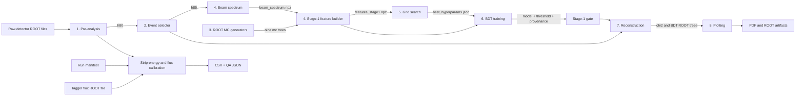
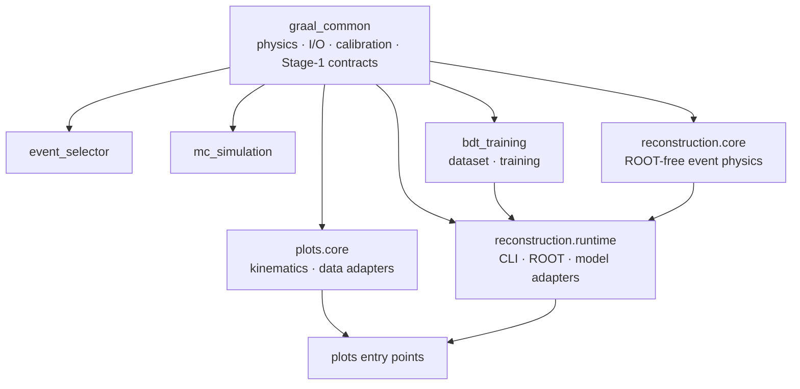

# Architecture

GRAAL Analysis is a file-oriented batch pipeline. ROOT files carry detector,
Monte Carlo, and reconstructed events between stages. NumPy NPZ, JSON, text,
CSV, and PDF files carry training, calibration, provenance, and reporting
artifacts. No server process or database is involved.

## End-to-end flow

Stages 4–6 form the training path. Stage 7 consumes its versioned runtime
bundle only for BDT-gated reconstruction; standard χ² reconstruction has no
model dependency.

## Package boundaries

Physical directories remain numbered so pipeline order is visible. Editable
installation maps them to valid Python package names such as `graal_common`,
`bdt_training`, and `reconstruction`.

## Main boundaries

- `00_common/` owns shared physical constants, channel and hypothesis
  registries, photon pairing, ROOT-array helpers, calibration contracts, and
  Stage-1 feature/artifact schemas.
- Numbered stage directories own orchestration and adapters specific to that
  stage.
- `reconstruction/core/` keeps event decisions and fitting independent from
  ROOT; `reconstruction/runtime/` owns ROOT I/O, CLI translation, and model
  loading.
- `plots/core/` separates reusable calculations and ROOT data conversion from
  plot orchestration.
- Tests enforce cross-module schemas where training output becomes runtime
  input.

## External boundaries

ROOT/PyROOT is detector and reconstructed-event storage/runtime boundary.
`uproot` and `awkward` provide array-oriented ROOT access in training and some
plotting paths. XGBoost supplies Stage-1 classifier; NumPy, SciPy,
scikit-learn, and matplotlib support calculation, fitting, evaluation, and
reporting. Pipeline execution calls no remote service or API.

`scripts/sync-wiki.sh` is separate from analysis execution. It uses Git and
GitHub only when a maintainer explicitly publishes in-repository wiki.
