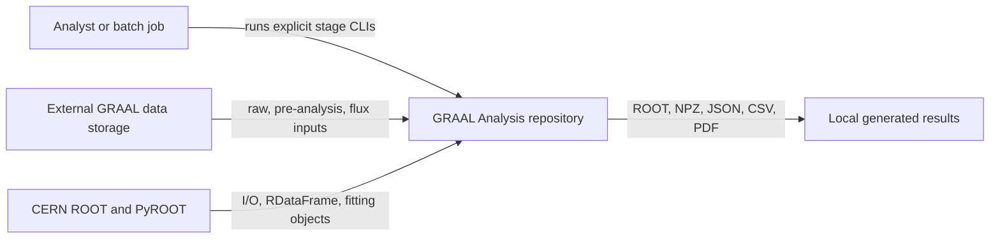
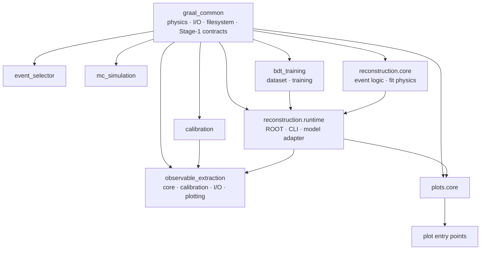

# Architecture

GRAAL Analysis is a set of numbered processing stages connected by persisted
scientific artifacts. Shared physics and I/O contracts live in `00_common/`,
while stage packages own their orchestration, validation, and outputs.

## System Context

```mermaid
flowchart LR
    ANALYST[Analyst or batch job]
    FARM[External GRAAL data storage]
    ROOT[CERN ROOT and PyROOT]
    REPO[GRAAL Analysis repository]
    RESULTS[Local generated results]

    ANALYST -->|runs explicit stage CLIs| REPO
    FARM -->|raw, pre-analysis, flux inputs| REPO
    ROOT -->|I/O, RDataFrame, fitting objects| REPO
    REPO -->|ROOT, NPZ, JSON, CSV, PDF| RESULTS
```

The analyst selects stage commands and paths. External storage owns large
experiment inputs. ROOT is both a storage boundary and runtime dependency.
Generated results remain local unless a maintainer deliberately versions a
small contract artifact, such as the Stage-1 runtime bundle.

The system has no database, web service, remote API call, or resident worker.
The filesystem is the integration surface.

## End-to-End Flow

Detector data follows `h80` pre-analysis and `h85` selection into
reconstruction. Monte Carlo and measured beam information form an independent
training branch whose runtime bundle is consumed only by BDT-gated
reconstruction. Calibration joins run metadata, `h80` observations, and
external tagger flux. Observable extraction is the first stage that needs both
reconstructed events and calibrated exposures.

The detailed diagram and artifact table live in [End-to-end workflow](workflow).
The split matters operationally: standard chi-square reconstruction does not
depend on a classifier, and calibration can be rebuilt without retraining one.

## Package Boundaries

```mermaid
flowchart TD
    COMMON[graal_common\nphysics · I/O · filesystem · Stage-1 contracts]
    SELECTOR[event_selector]
    MC[mc_simulation]
    TRAIN[bdt_training\ndataset · training]
    RECOCORE[reconstruction.core\nevent logic · fit physics]
    RECORT[reconstruction.runtime\nROOT · CLI · model adapter]
    CAL[calibration]
    OBS[observable_extraction\ncore · calibration · I/O · plotting]
    PLOTCORE[plots.core]
    PLOTS[plot entry points]

    COMMON --> SELECTOR
    COMMON --> MC
    COMMON --> TRAIN
    COMMON --> RECOCORE
    COMMON --> RECORT
    COMMON --> CAL
    COMMON --> OBS
    COMMON --> PLOTCORE
    TRAIN --> RECORT
    RECOCORE --> RECORT
    CAL --> OBS
    RECORT --> OBS
    RECORT --> PLOTCORE
    PLOTCORE --> PLOTS
```

| Boundary | Owns | Must not own |
|---|---|---|
| `graal_common` | Stable physics and artifact contracts used by multiple stages | Stage-specific CLI orchestration |
| `reconstruction.core` | Numerical event decisions and constrained fit | ROOT files or CLI parsing |
| `reconstruction.runtime` | ROOT translation, command options, Stage-1 model adapter | Training the classifier |
| `observable_extraction.core` | Estimators, background models, covariance | ROOT object creation |
| `observable_extraction.io` | Reconstructed-event and ROOT-output adapters | Estimator policy |
| `plots.core` | Reusable arrays and kinematics | Upstream reconstruction |

Physical source directories remain numbered, but editable installation maps
them to the import names shown above.

## External Boundaries

- **CERN ROOT/PyROOT** supplies detector and reconstructed-event I/O,
  RDataFrame selection, histograms, graphs, canvases, and ROOT-side fitting.
- **uproot and awkward** provide array-oriented access where code does not need
  live PyROOT objects.
- **NumPy and SciPy** implement numerical arrays, optimization, and statistics.
- **scikit-learn and XGBoost** support model selection, metrics, and the
  Stage-1 classifier.
- **matplotlib** renders non-ROOT diagnostic figures.
- **Filesystem inputs** supply raw data, pre-analysis files, Monte Carlo, and
  tagger flux; no stage downloads them.

Trust-boundary validation occurs before values enter shared cores and again
before outputs replace previous valid artifacts. See [Architectural decisions](architecture-decisions)
for the rationale and [Data and artifacts](data-and-artifacts) for formats.
