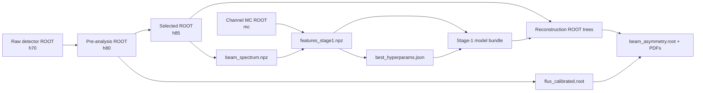

# Data and Artifacts

Filesystem artifacts are the explicit interfaces between stages. ROOT trees
carry events, NPZ files carry dense numerical datasets, JSON and text files
carry model metadata, CSV files carry calibration tables, and ROOT/PDF files
carry scientific results. Consumers validate the contract they need instead
of relying on a central database.

## Artifact Lineage



| Producer | Main artifact | Consumer |
|---|---|---|
| acquisition | raw period ROOT, tree `h70` | Stage 01 |
| pre-analysis | `pre_analisi_<period>.root`, tree `h80` | event selection and calibration |
| event selection | selected ROOT files, tree `h85` | beam spectrum and reconstruction |
| MC generators | `<channel>_mc.root`, tree `mc` | training dataset and fit validation |
| beam-spectrum builder | `beam_spectrum.npz` | channel weighting and feature build |
| feature builder | `features_stage1.npz` | hyperparameter search and final trainer |
| search | `best_hyperparams.json`, `grid_search_results.csv` | trainer and audit |
| final trainer | model, threshold, provenance | Stage-1 reconstruction gate |
| reconstruction | nominal, fitted, sideband, and control ROOT trees | observable extraction and plots |
| calibration | `data/00_external/flux_calibrated.root` | observable extraction and ROOT inspection |
| observable extraction | `beam_asymmetry.root` and PDFs | review and publication |

## ROOT Trees

| Tree | Owner | Key content and boundary |
|---|---|---|
| `h70` | external acquisition | detector-level source consumed by C++ pre-analysis |
| `h80` | Stage 01 | normalized detector/pre-analysis branches, including run, tagger, beam, particle collections |
| `h85` | Stage 02 | all `h80` branches for events passing photon and forward-track selection |
| `mc` | Stage 03 | generated/smeared event vectors, truth branches, generator metadata |
| `reco_eta_pi0_chi2` | Stage 05 | reference chi-square reconstruction |
| `reco_eta_pi0_bdt` | Stage 05 | Stage-1-gated eta-pi0 reconstruction, optional fit branches |
| `reco_eta_pi0_bdt_sideband` | Stage 05 | broad raw-mass BDT control sample without fit branches |
| `reco_2pi0` | Stage 05 | alternate two-pi0 reconstruction/control |
| `sigma_points` | Stage 07 | flattened asymmetry points, uncertainties, normalization, fit diagnostics |

Reconstruction tree contracts are described in
[Reconstruction](05-reconstruction). Observable ROOT objects and branches are
listed in [Systematics and Outputs](07-systematics-and-outputs).

ROOT files may contain multiple key cycles. Readers that require a canonical
object reject ambiguous or malformed layouts rather than silently choosing a
different cycle. Tree adapters also fail on missing required branches and
unreadable/zombie files.

## Training and Calibration Formats

### Training NPZ and model bundle

`beam_spectrum.npz` stores normalized histogram `edges` and `density` arrays.
`features_stage1.npz` stores exactly `X`, `y`, `w`, `feature_names`,
`signal_channel`, `hypothesis`, `signal_prior`, and `beam_reweighted`. The
matrix has 26 ordered features; metadata is part of the model interface.

The runtime bundle under `04_bdt_training/artifacts/stage1/` is indivisible:

| File | Role |
|---|---|
| `bdt_stage1.json` | XGBoost model |
| `stage1_threshold.txt` | inclusive acceptance threshold |
| `stage1_provenance.json` | closed physics/feature schema |

Metrics and PNG reports document training but are not runtime dependencies.
All three runtime files must be replaced together; current provenance does not
cryptographically bind them.

### Calibration ROOT

| File | Contract |
|---|---|
| `data/00_external/flux_calibrated.root` | calibrated per-run flux histograms on photon-energy axes and calibration fit objects |

Stage 06 publishes no CSV or JSON side products. Its checks still validate
run/strip mappings and flux values before atomic ROOT replacement; diagnostics
are reported through stderr and exit status. Stage 07 consumes this ROOT file
directly. A run is usable only when exactly one `POL1`, `POL2`, and `BREM`
histogram is present; otherwise Stage 07 skips the entire run for every
polarization. See [Calibration](06-calibration).

### Full-campaign layout

`python scripts/run_pipeline.py --mode test_data` writes
`results/test_data/`; production writes `results/production/`. Both use this
ownership boundary:

```text
results/<mode>/
|-- common/flux_calibrated.root
|-- uv/{selected,mc,bdt,reco,beam_asymmetry}/
|-- vis/{selected,mc,bdt,reco,beam_asymmetry}/
|-- combined/
`-- pipeline_commands.log
```

Only final Stage-07 point products are composed under `combined/`. Selected
events, MC, BDT bundles, reconstructions, and asymmetry ROOT files stay
profile-local. Ajaka digitization is tracked at
`07_observable_extraction/references/ajaka2008_figure4_digitized.csv`, not a
generated or ignored local fixture.

## Ownership and Persistence

| Location | Ownership | Git behavior |
|---|---|---|
| source, tests, config, wiki | repository contracts | tracked |
| `04_bdt_training/artifacts/stage1/` | released runtime model and reports | currently tracked |
| `data/00_external/flux.root` | small external calibration input | explicitly allowed by `.gitignore` |
| `07_observable_extraction/references/ajaka2008_figure4_digitized.csv` | published comparison data | tracked |
| `data/00_external/flux_calibrated.root` | generated Stage 06 calibration | ignored by Git; replace atomically |
| other `data/` content | raw, selected, or farm-linked experimental data | ignored |
| `results/` | generated reconstruction, calibration, plots, observables | ignored |
| `03_mc_simulation/data/*.root` and general `*.root`, `*.npz` | large generated artifacts | ignored unless explicitly unignored |
| `.venv/`, caches, build products | local environment | ignored |

Ignored does not mean disposable. Production artifacts may be expensive or
impossible to regenerate without external data. Preserve validated releases in
the experiment's storage system together with command line, source revision,
input identities, and environment information. Git only protects tracked
contracts and the explicitly versioned small/model artifacts.

Atomic publication is stage-specific: event selection and signal-MC
preparation stage complete directories before replacement; calibration and
observable ROOT output use temporary sibling files. Reconstruction and most
plotting entry points write ROOT/PDF outputs directly. Never infer atomicity
from a file extension.
