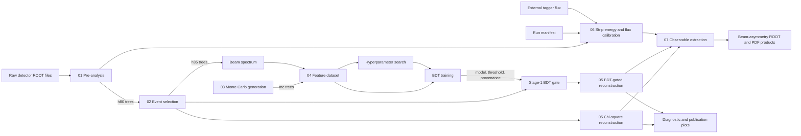

# End-to-End Workflow

The workflow begins with detector ROOT files and branches into event
preparation, Monte Carlo and classifier training, calibration,
reconstruction, observable extraction, and plotting. Stages are run through
their own entry points and communicate through validated files. The sequential
`scripts/run_pipeline.py` launcher coordinates the supported UV/VIS campaign
from pre-analysis onward.

## Execution Model

There is one central version-one runner, `scripts/run_pipeline.py`, but no DAG,
scheduler, queue integration, freshness database, or resume. It validates
inputs, runs each supported stage sequentially, records commands, and stops on
the first nonzero exit. Numbered directories still own stage behavior and file
contracts.

The launcher supports `test_data` and `production`, both beginning with
`pre_analisi_*.root` files containing `h80`. Raw `h70` pre-analysis remains a
separate operation. Manual stage invocation remains supported for diagnostics.

## Main Data Flow

| Producer | Artifact | Consumer |
|---|---|---|
| Pre-analysis | ROOT `h80` trees | Event selection, calibration |
| Event selection | ROOT `h85` trees | Beam spectrum, reconstruction |
| MC generators | ROOT `mc` trees | Feature builder, fit validation |
| Beam-spectrum builder | `beam_spectrum.npz` | Channel weighting and features |
| Feature builder | `features_stage1.npz` | Grid search and final training |
| Grid search | `best_hyperparams.json` | Final training |
| Final training | Model, threshold, provenance | Stage-1 runtime gate |
| Reconstruction | Reconstructed and sideband ROOT trees | Observable extraction, plots |
| Calibration | Calibrated ROOT flux (`data/00_external/` standalone; `results/<mode>/common/` launcher) | Observable extraction |
| Observable extraction | Result ROOT and PDF products | Scientific review and publication |

## Training Branch

The training branch can be prepared independently of detector reconstruction
once registered Monte Carlo and a measured beam spectrum exist. It performs:

1. registered channel generation or completeness checking;
2. beam-spectrum construction from selected data;
3. identical photon-loss and acceptance processing for all classes;
4. fixed-schema Stage-1 feature construction;
5. hyperparameter search;
6. final fit and threshold selection;
7. publication of model, threshold, and provenance as one runtime contract.

The full launcher skips a new hyperparameter search, reuses the checked-in
`best_hyperparams.json`, and trains independent fresh UV and VIS bundles.

Only the BDT-gated reconstruction path consumes that bundle. Standard
chi-square reconstruction remains a model-independent comparison.

## Calibration Branch

Calibration can proceed after pre-analysis and does not require selected
`h85` events or a trained classifier. It joins:

- a run manifest describing run groups and polarization state;
- tagger observations from `h80` files;
- external per-run tagger-flux histograms.

It derives strip energies, validates run/strip flux consistency, aggregates
flux into configured energy bins, and atomically publishes the configured ROOT
output. Diagnostics stay in the process log. Standalone runs default to
`data/00_external/flux_calibrated.root`; the launcher writes shared
`common/flux_calibrated.root` and passes it with the checked-in run manifest to
both profile-local Stage-07 extractors.

## Reuse and Failure Boundaries

Stages do not implement a global freshness database. Reuse is explicit:
operators point commands at existing artifacts after confirming their inputs,
schemas, and provenance still match.

Local safeguards prevent the most dangerous silent reuse:

- event selection refuses to leave stale output in place when no valid
  `pre_*.root` input exists;
- atomic directory publication preserves previous selected data until new
  output validates;
- Monte Carlo status distinguishes missing channels from an internal status
  failure and reports old files without declaring them absent;
- the Stage-1 gate validates all runtime-bundle members and hypothesis
  provenance before scoring;
- calibration separates warning-only quality findings from fatal structural or
  numerical invalidity and atomically replaces one ROOT output;
- observable estimators validate exposure, polarization, fit, and physical
  domains before reporting a result.

For exact schemas, see [Data and artifacts](data-and-artifacts). For recovery
actions, see [Troubleshooting](troubleshooting).
