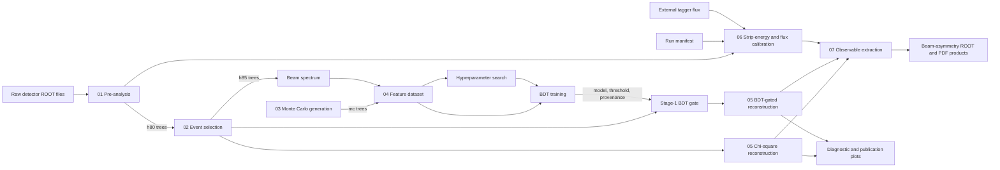

# End-to-End Workflow

The workflow begins with detector ROOT files and branches into event
preparation, Monte Carlo and classifier training, calibration,
reconstruction, observable extraction, and plotting. Stages are run through
their own entry points and communicate through validated files.

## Execution Model

There is no central scheduler. A user or farm job invokes each stage command,
chooses paths, inspects failure status, and advances only after required
artifacts exist. Numbered directories communicate the intended order; they do
not create hidden checkpoints or automatically infer dependencies.

This explicit model makes every scientific boundary inspectable. It also means
production automation must call the same supported entry points and preserve
their validation behavior rather than bypassing it.

## Main Data Flow

| Producer | Artifact | Consumer |
|---|---|---|
| Pre-analysis | ROOT `h80` trees | Event selection, calibration |
| Event selection | ROOT `h85` trees | Beam spectrum, reconstruction |
| MC generators | ROOT `mc` trees | Feature builder, fit validation |
| Beam-spectrum builder | `beam_spectrum.npz` | Channel weighting and features |
| Feature builder | `features_stage1.npz` | Grid search and final training |
| Grid search | `best_hyperparams.json` | Final training |
| Final training | Model, threshold, provenance | Stage-1 runtime gate |
| Reconstruction | Reconstructed and sideband ROOT trees | Observable extraction, plots |
| Calibration | Exposure CSV/JSON/ROOT products | Observable extraction |
| Observable extraction | Result ROOT and PDF products | Scientific review and publication |

## Training Branch

The training branch can be prepared independently of detector reconstruction
once registered Monte Carlo and a measured beam spectrum exist. It performs:

1. registered channel generation or completeness checking;
2. beam-spectrum construction from selected data;
3. identical photon-loss and acceptance processing for all classes;
4. fixed-schema Stage-1 feature construction;
5. hyperparameter search;
6. final fit and threshold selection;
7. publication of model, threshold, and provenance as one runtime contract.

Only the BDT-gated reconstruction path consumes that bundle. Standard
chi-square reconstruction remains a model-independent comparison.

## Calibration Branch

Calibration can proceed after pre-analysis and does not require selected
`h85` events or a trained classifier. It joins:

- a run manifest describing run groups and polarization state;
- tagger observations from `h80` files;
- external per-run tagger-flux histograms.

It derives strip energies, aggregates flux into configured energy bins, writes
exposure tables and calibrated ROOT objects, and records QA. Observable
extraction consumes these products together with reconstructed events.

## Reuse and Failure Boundaries

Stages do not implement a global freshness database. Reuse is explicit:
operators point commands at existing artifacts after confirming their inputs,
schemas, and provenance still match.

Local safeguards prevent the most dangerous silent reuse:

- event selection refuses to leave stale output in place when no valid
  `pre_*.root` input exists;
- atomic directory publication preserves previous selected data until new
  output validates;
- Monte Carlo status distinguishes missing channels from an internal status
  failure and reports old files without declaring them absent;
- the Stage-1 gate validates all runtime-bundle members and hypothesis
  provenance before scoring;
- calibration separates warning-only quality findings from fatal structural or
  numerical invalidity and publishes through staging;
- observable estimators validate exposure, polarization, fit, and physical
  domains before reporting a result.

For exact schemas, see [Data and artifacts](data-and-artifacts). For recovery
actions, see [Troubleshooting](troubleshooting).
